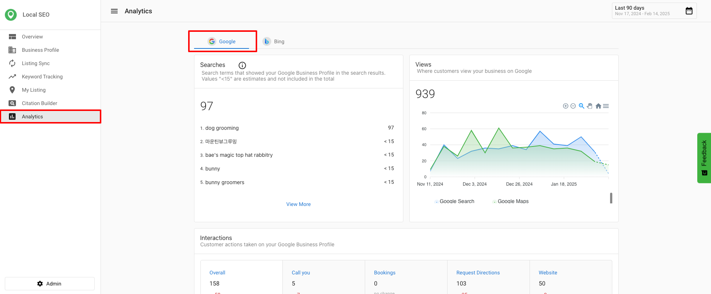
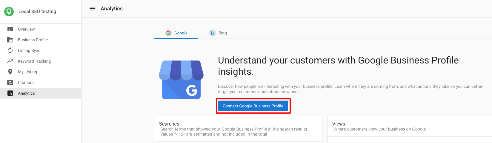
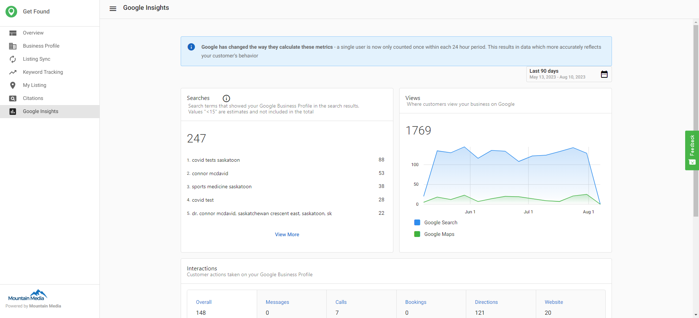
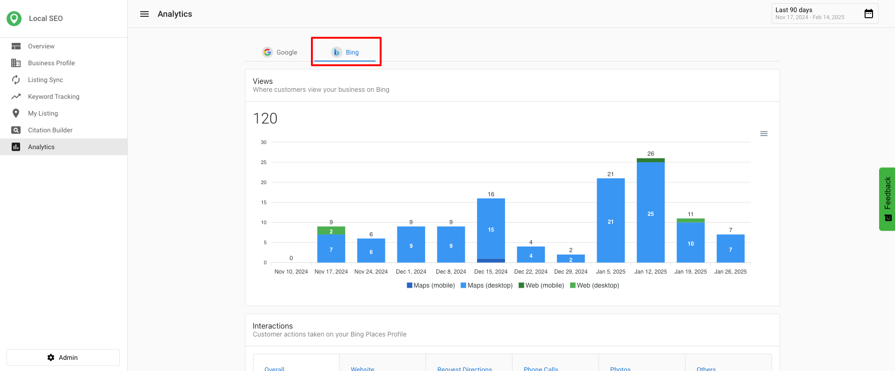

# Analytics

In this section, you'll learn about the analytics capabilities available in Local SEO. Use these insights to measure performance, track customer interactions, and optimize your local search strategies.

## What is analytics in Local SEO?

Analytics in Local SEO provide valuable insights into how a business is performing on search platforms Google and Bing. By tracking key metrics, businesses can better understand customer interactions, refine their digital marketing strategies, and optimize local search presence.

## Google business profile insights in Local SEO

Google Business Profile Insights provide a detailed overview of how customers find and interact with a business on Google. These metrics help businesses assess their online visibility and customer engagement.

### Key Google metrics available in Local SEO

- **Search Terms** – Displays the queries people use to find a business. (Available in Local SEO and Executive Report.)
- **Search Total** – Shows the total number of searches where the business appeared. (Available in Local SEO, Executive Report, Multi-Location, and Multi-Location Executive Report.)
- **Customer Interaction [Bookings]** – Tracks completed customer bookings. (Available in Local SEO, Executive Report, Multi-Location, and Multi-Location Executive Report.)

:::note
Google updates the Searches metric at the beginning of each month, and it may take up to five days to reflect new data.
:::

### Accessing Google business profile analytics in Local SEO

1. Go to `Local SEO` > `Analytics` > `Google`.
2. Click `Connect Google Business Profile`. If you do not have an account, click `Create a Google Business Profile account` to sign up.

After connecting, you can view metrics such as searches, where customers view your business, and common customer actions.

## Bing insights in Local SEO

Bing Insights allow Local SEO Pro users to see how their business listings perform on Bing. This feature enhances visibility into search traffic and customer interactions beyond Google.

### Key Bing metrics available in Local SEO

- Traffic insights to measure Bing as a source of customer visits.
- Customer interactions based on listing visibility and engagement.
- Performance trends for evaluating marketing effectiveness.

## Accessing Bing analytics in Local SEO

### Bing insights

1. Navigate to the **Analytics** tab in Local SEO.
2. View Google-specific data related to search queries, interactions, and overall visibility.

### Yext insights (available for Apple Business Connect pro users)

1. Select a **Local SEO Pro** account.
2. Ensure that the Bing profile is created and synced under **Listing Sync**.
3. Go to the **Analytics** section and click on **Bing Insights** to view performance data.

:::note
If Bing sync is disabled, users will need to enable it to access Bing insights. New syncs require time to backfill data from the last 90 days.
:::

## Why these insights matter

- **Better Decision Making** – Helps businesses understand which search platforms are driving traffic.
- **Improved Engagement Strategies** – Aligns customer interactions with business goals.
- **More Control Over Listings** – Ensures that businesses can monitor and adjust their presence on both Google and Bing.