# Business Profile

Manage your Business Profile information effectively to improve local search visibility and customer experience. This section covers various aspects of configuring and optimizing your Business Profile in Local SEO.

## What is Business Profile?

You can manage core business details in the `Business Profile` tab. This includes profile data, `Special Hours` (holiday hours), category-specific Google attributes, `More Hours`, and tools for AI-generated business descriptions.

## Why is Business Profile important?

- Streamlines profile setup so you can quickly start using the product and syncing.
- Helps you control hours that extend past midnight and holiday exceptions.
- Lets you add category-specific Google attributes that can help your business appear in relevant searches.
- Supports service area businesses by allowing you to hide the physical address where supported.

## What’s included with Business Profile?

- **Hours of Operation**: Set hours, including hours that extend past midnight.
- **Special Hours**: Add holiday hours and exceptions under `Hours`.
- **More Hours**: Add category-specific hours (for example, delivery, drive-through, takeout, pick-up) under `Hours`.
- **Google Attributes**: Configure category-specific attributes under `More`.
- **AI-Generated Descriptions**: Generate short and long descriptions under `Marketing` in `Business Profile`.
- **Image Requirements**: Follow Google Business Profile image guidelines for logos, primary, and additional photos.
- **Service Area Business**: Hide the physical address (where supported) for service area businesses, including bulk updates.

:::info
Any account with Local SEO, a Listing Sync Pro add-on, or Citation Builder can sync out `Special Hours` and category-specific Google attributes. These fields are available under the `Hours` and `More` tabs.
:::

## How to use Business Profile

### Generate AI business descriptions
Use AI to quickly create short and long business descriptions from the `Marketing` tab in `Business Profile`. This feature works when Local SEO and/or Listing Sync Pro is active.
1. Go to `Business Profile` and select the `Marketing` tab.
   
   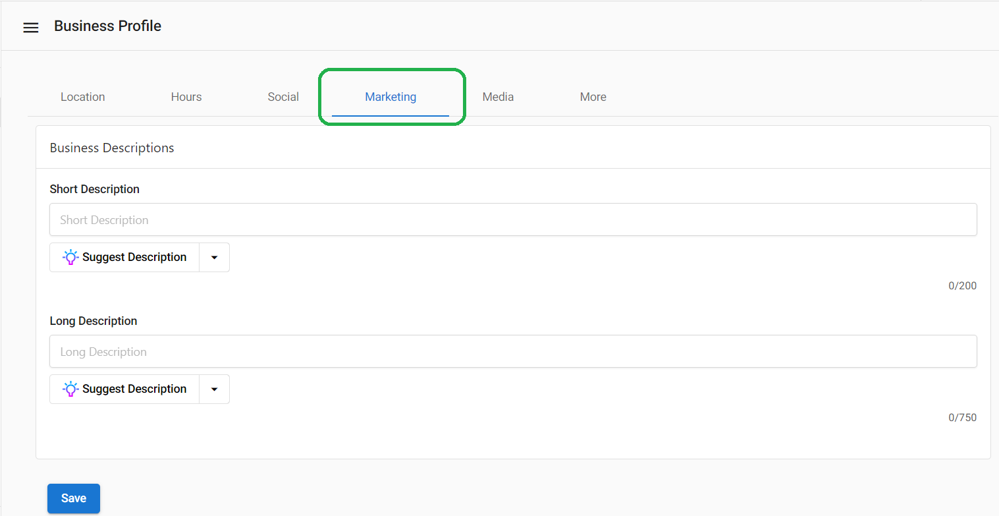

2. Click `Suggest Description`.
   
   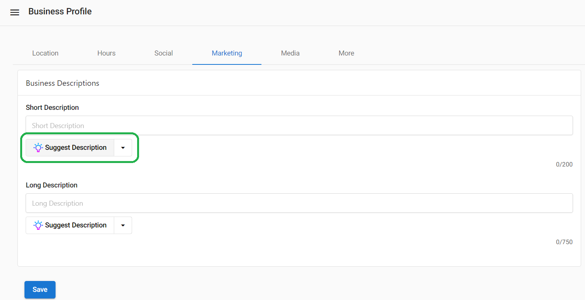

3. Use the dropdown to explore options. Select `Create from current content` to build from an existing description.
   
   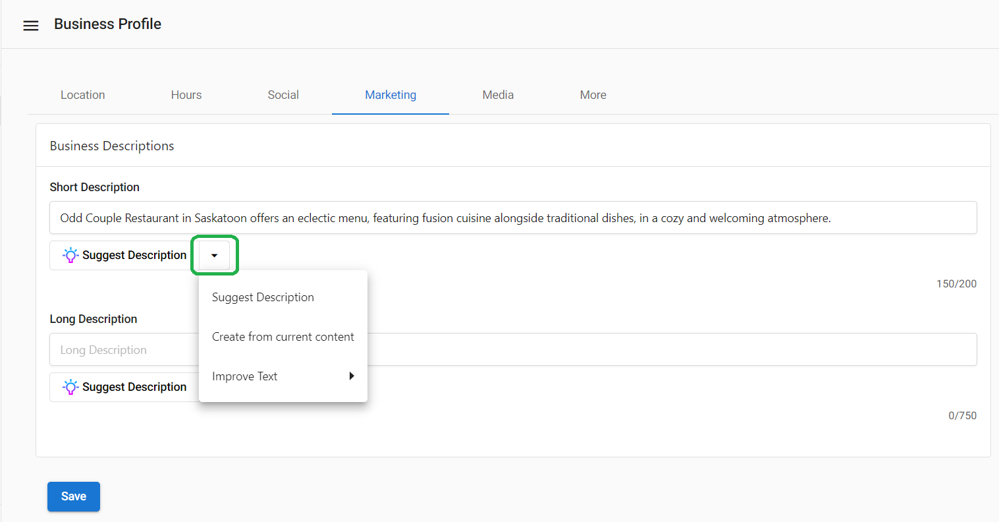

4. Select `Improve Text` to fix spelling and grammar, shorten the text, or adjust tone.
   
   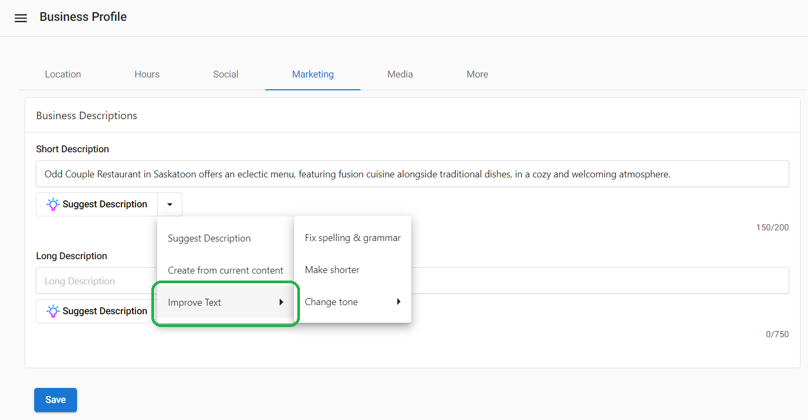

5. Choose a tone such as friendly, professional, or witty.
   
   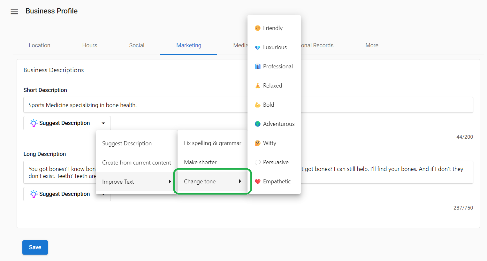

### Long description syndication to Google Business Profile
The `Long Description` field in `Business Profile` > `Marketing` syncs to a connected Google Business Profile when sync is on. If this field contains content, it will be published to the connected profile. If blank, no changes are made.

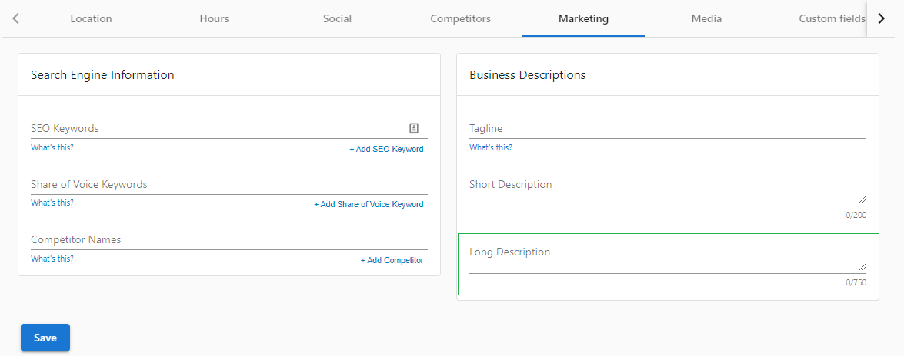

Recommendations:

- Describe services or products, history/values, and essential details a customer should know.
- Keep content under 750 characters and avoid URLs or HTML.

### Set hours of operation (including past midnight)
1. Open `Business Profile` and go to the `Hours` tab.
2. Enter your hours, including ranges that extend past midnight (for example, `11:00 am - 3:00 am`).
   
   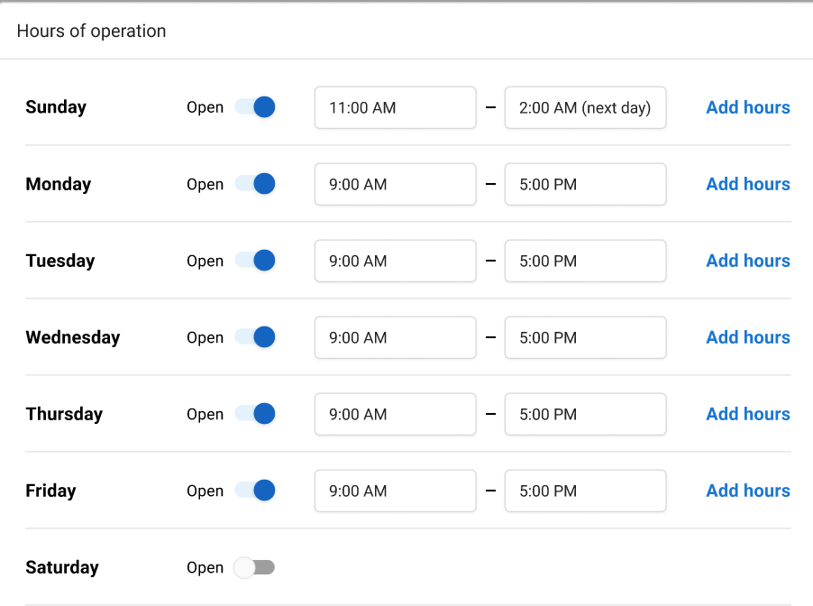

:::warning
Changes to hours typically occur quickly, but in some cases can take 3–5 days to sync to Google. Plan updates accordingly.
:::

### Manage special hours and Google attributes
- `Special Hours` are under the `Hours` tab and are ideal for holidays and exceptions to your regular hours.
- Category-specific Google attributes are under the `More` tab. Available attributes vary by business category.

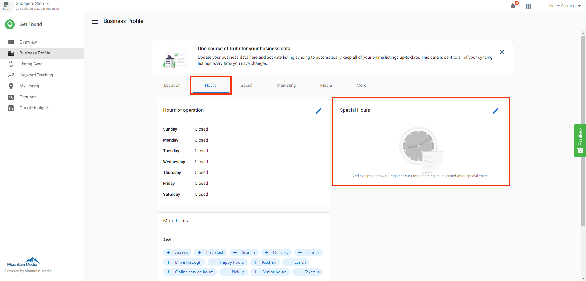

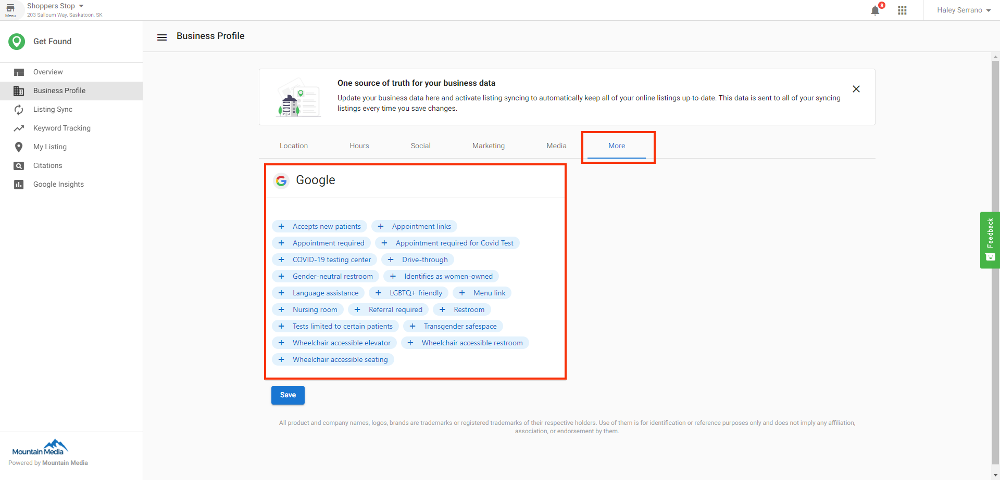

### Set primary and additional categories
Categories help directories classify your business. The first category sent is treated as the primary category. Additional categories may sync to listing networks that support them. Keep categories aligned across the product to avoid sync failures on category‑sensitive networks.

### Use more hours
All users can access `More Hours` from the `Business Profile` tab.
1. In `Business Profile`, open the `Hours` tab to view and manage `More Hours`.
2. Add category-specific hours such as delivery, drive-through, takeout, or pick-up.
   
   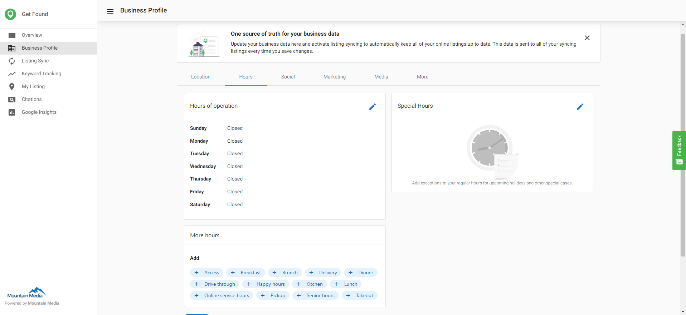

:::info
This syncing field is available in the `Business Profile` tab. You can find the remainder of business data in the account management area.
:::

### Hide your physical address (service area businesses)
You can list your business as a service area business and hide the physical address in Listing Sync Pro, Citation Builder, and in Listings Grade in the Snapshot Report. This improves accuracy for businesses that operate without a public storefront. It also improves the accuracy of your listing score and the listing grade in the snapshot report.

:::warning
Some listing sources do not support hidden addresses. This may reduce the number of available sources to sync. It does not negatively affect your listing score.
:::

#### Set during new account creation
1. In the `Business Profile` section of account creation, check `Service Area Business (hide physical address)` (below `Zip/Postal Code`). It is off by default.
   
   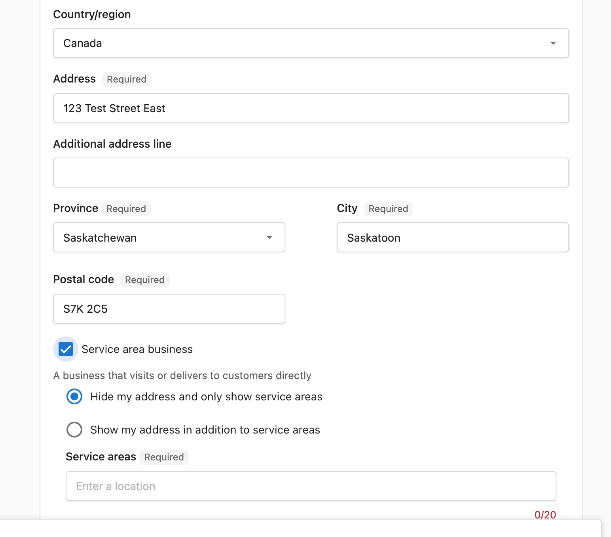

#### Update an existing account
1. Open `Accounts` and select the business to edit.
2. Click `View all data`.
3. Under `Location`, below `Zip/Postal Code`, check `Service Area Business (hide physical address)`.
4. Click `Save`.

#### Update multiple existing accounts (bulk)
1. Open `Accounts`.
2. Click the menu next to `Create Account` > select `Update Accounts (CSV Upload)`.
   
   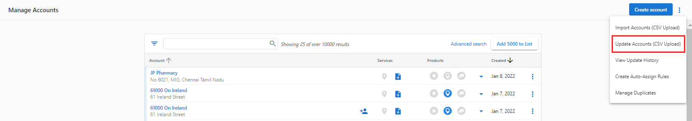

3. Prepare a CSV with the new data or export an existing list. The template includes a `Service Area Business` column; enter `Yes` for each applicable account.
   
   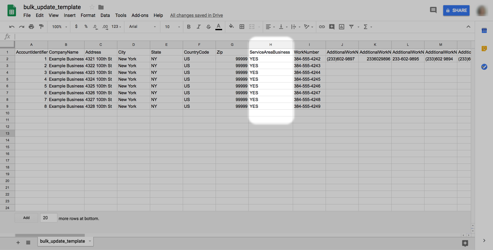

4. Upload the CSV and click `Next`.
5. Select the `Address` box.
6. Choose whether empty cells should overwrite existing data and click `Next`.
7. Review changes and click `Update`.
   
   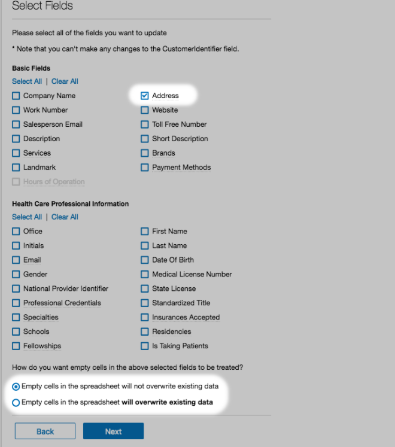

:::warning
Hidden address updates can take 6–8 weeks to sync across all listing platforms.
:::

### Follow image and photo requirements (Google Business Profile)
- **Formats**: JPG, PNG
- **File size**: 10 KB–5 MB
- **Logo**: Recommended 250×250 px (min 120×120 px; max 5200×5300 px)
- **Primary Photo**:
  - Aspect ratio 16:9
  - Recommended 1080×608 px (min 480×270 px; max 2120×1192 px)
  - Ensure the photo is in focus, well-lit, with no excessive filters or alterations
- **More Photos**:
  - Photos added to `More Photos` in `Business Profile` will sync to Google Business Profile if syncing is on for a connected profile
  - Photos are not removed if the same photo is not present in `More Photos`

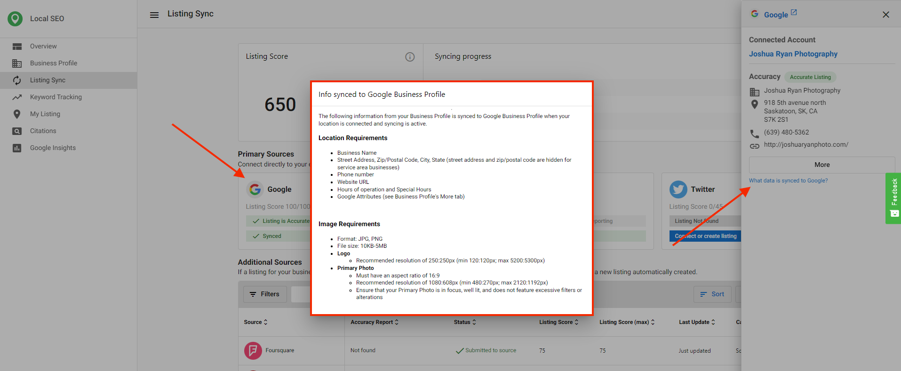

### Review google business profile updates
You can review and manage updates that Google proposes to your profile. Approve changes to accept Google’s updates and sync them, or reject changes to republish your current data.

Requirements:

- the profile must be authenticated
- local seo must be active
- `sync` must be enabled for the business

Manual approval is required to comply with Google policies. Automatic overwrites are not allowed.

### Verify your Google Business Profile
Follow Google’s verification steps to verify your profile.

Desktop:
1. Sign in to `https://business.google.com/` and select the business.
2. Click `Verify now` and ensure the address is accurate.
3. Click `Send postcard` and watch for delivery (typically within 14 days).

Mobile:
1. Open the Google Business Profile app and tap `Send postcard`.
2. Select the business, tap `I don't have a code` if needed.

Enter your code:
1. After the postcard arrives, sign in and choose the location.
2. Click `Verify location` or `Verify now` and enter the 5‑digit code.

:::info
You can also find these details by going to `Local SEO` > `Listing Sync` > select `Google` > `What data is synced to Google?`
:::

## Frequently asked questions (FAQs)

What are AI-generated business descriptions?

AI-generated descriptions help you quickly create short and long descriptions from the `Business Profile` > `Marketing` tab.

Where do I generate or improve a description?

Go to `Business Profile` > `Marketing`, click `Suggest Description`, and use options like `Create from current content` or `Improve Text`.

Can I change tone or fix grammar in a description?

Yes. Use `Improve Text` to fix spelling and grammar, shorten the text, or change the tone (for example, friendly, professional, witty).

How do I set hours that extend past midnight?

Open `Business Profile` > `Hours` and enter a range that crosses midnight (for example, `11:00 am - 3:00 am`).

How long do hour changes take to sync?

Changes typically occur quickly, but may take 3–5 days to sync to Google.

What are Special Hours and where do I set them?

Special Hours are holiday hours and exceptions. Set them under the `Hours` tab.

What is More Hours?

More Hours lets you set category-specific hours (for example, delivery, drive-through, takeout, pick-up). Manage them under `Business Profile` > `Hours`.

Who can sync Special Hours and Google attributes?

Any account with Local SEO, a Listing Sync Pro add-on, or Citation Builder can sync Special Hours and category-specific Google attributes.

Can I hide my physical address?

Yes. Mark the account as a service area business by checking `Service Area Business (hide physical address)`. You can do this during account creation, for a single existing account, or in bulk via CSV.

Do all listing sources support a hidden address?

No. Some sources do not support it, which can reduce available syncing sources. This does not negatively impact your listing score.

What image formats and sizes are supported?

Use JPG or PNG between 10 KB and 5 MB. Follow the listed size recommendations for logos and primary photos.

What are the logo and primary photo size guidelines?

Logo: recommended 250×250 px (min 120×120; max 5200×5300). Primary photo: 16:9 aspect; recommended 1080×608 (min 480×270; max 2120×1192).

Are photos in More Photos synced to Google?

Yes, if syncing is on for a connected Google Business Profile. Photos are not removed if the same photo is not present in `More Photos`.

Where can I manage the rest of my business data?

You can manage additional business data in the account management area.

Where can I view Google image requirements in the product?

Go to `Local SEO` > `Listing Sync` > select `Google` > `What data is synced to Google?`

