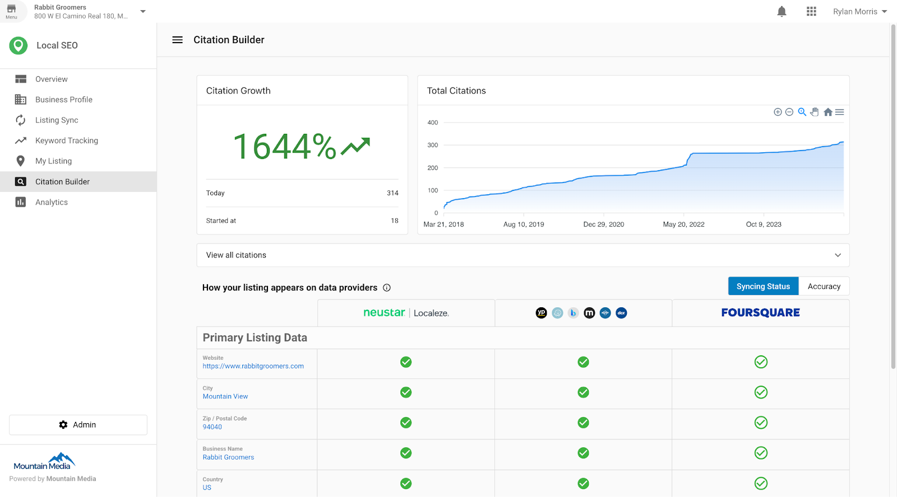
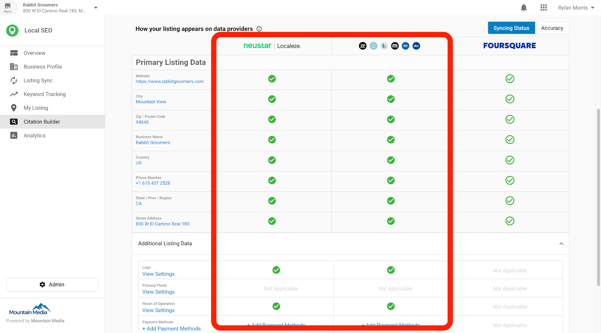
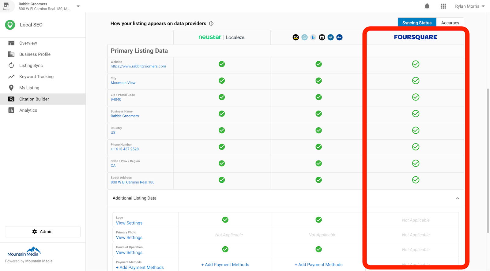
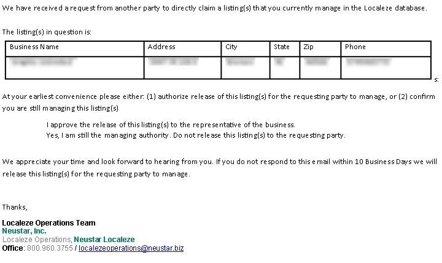
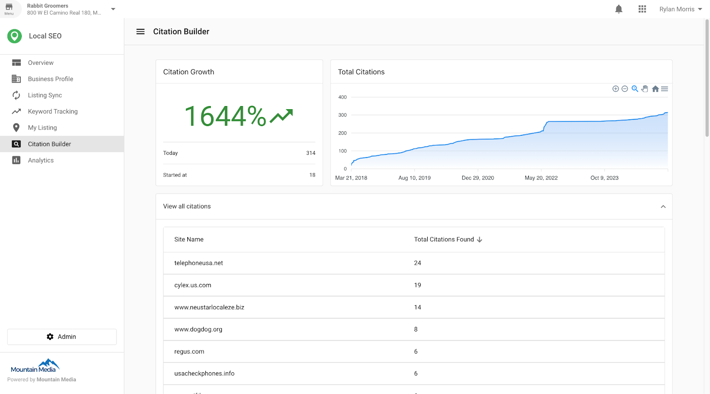

## What is Citation Builder?

Citation Builder helps you submit accurate business data to major data aggregators so your information appears consistently across directories, search engines, and apps.

## Why is Citation Builder important?

- Consistent listings improve local search visibility.
- Aggregators distribute your data to many platforms that users rely on.
- Ongoing distribution helps keep details up to date across the web.

## What’s Included with Citation Builder?

- **Data Submission** to two aggregators: **TransUnion's Neustar/Localeze** and **Foursquare**.
- **Verification and Conflict Handling** guidance for aggregator workflows.
- **Reporting** to track citation growth, distribution, and data accuracy.
- **Update Timeline** expectations for submissions and downstream publication.

## How data submission works

### Information sent to aggregators
- Primary data submitted to both aggregators includes: Business name, address, city, state/province/region, country, zip/postal code, phone number, and website.
- Additional data (accepted by some sources): Hours of operation, payment methods, business description, services, brands, keywords, landmark, and toll-free number.
- Healthcare records (where applicable): Firm/clinic/office name, first name, last name, email, professional credential, NPI, gender, insurances accepted, and school.

### Aggregator verification
- Aggregators compare submitted data against authoritative sources (for example, postal records). They may make formatting adjustments and may contact businesses for verification.

### Aggregator specifics
#### TransUnion's Neustar/Localeze
- Collects, verifies, and distributes business data to directories, search engines, navigation tools, mobile apps, and more.
- Tracks acceptance and distribution, including reporting to several key platforms.

#### Foursquare
- Acts as a submission-only provider for this product.
- Distributes business data to platforms that rely on Foursquare.

### Verification examples
- Neustar/Localeze may send a conflict-resolution email when a listing is already claimed. If approved, control is transferred; if not, updates cannot be applied; if no response within 10 business days, the listing is released.

### Toll-free numbers
- Toll-free numbers are supported. Neustar/Localeze has a dedicated field for toll-free numbers.
- To use a toll-free number as the main phone, a standard number must also be provided. Acceptance as a primary number is not always guaranteed.

### Selecting the correct category
- Choosing the correct business category or taxonomy ID ensures accurate classification and helps avoid syncing issues with sources that do not support generic categories.

## Reporting

- View total citations created since activation and new citations added over time.
- See distribution by source in the “View all citations” area.
- Review syncing status and accuracy of name, address, and phone number across platforms.

## Update timeline and expectations

- Submission typically occurs within 24 hours of data entry.
- Aggregators may confirm acceptance within 6–8 weeks.
- Aggregators then share information with citation sources, which may take 2–3 months to publish updates (varies by source).
- Search engines and directories pick up changes on their own refresh cycles.

## Frequently Asked Questions (FAQs)

How does Citation Builder work?

It submits business information to data aggregators (TransUnion's Neustar/Localeze and Foursquare). These aggregators distribute data to directories, search engines, navigation systems, voice assistants, and mobile apps.

What is a data aggregator?

An organization that collects, verifies, and distributes business data to many platforms to keep listings accurate and consistent.

How long do updates take?

Submission occurs within about 24 hours; aggregator acceptance can take 6–8 weeks; downstream sources may publish in 2–3 months; pickup by search engines varies by their refresh cycles.

Why is this offered as a yearly subscription?

Data distribution is ongoing. Maintaining an active subscription helps keep information current and consistent as sources refresh at different intervals.

How often can I update my business profile?

You can update business details at any time. Changes are submitted to aggregators after they are saved.

What happens with duplicate listings?

The product does not delete duplicates directly. It ensures authoritative sources reference correct data so directories relying on aggregators adjust over time.

Is this available outside the United States?

Available only for US-based businesses.

Why does the Foursquare column show “Not Applicable”?

If the physical address is hidden (service area business), Foursquare requires a visible address and will exclude the submission.

What happens if I cancel?

Submissions to aggregators stop. Citations are no longer actively monitored, and third parties may override existing entries over time.

