# Keyword Tracking

Manage how you track and report on keywords. This section provides a single overview of settings, usage, tips, and troubleshooting.

## What is Keyword Tracking?

Keyword Tracking helps you monitor how a business ranks for specific search terms over time. You can add keywords, view positions in a grid, analyze trends, and manage which keywords appear in reports.

## Why is Keyword Tracking important?

- Understand ranking performance for target keywords.
- Identify changes in visibility over time.
- Focus efforts on terms with the most impact.

## What’s included with Keyword Tracking?

- **Add Keywords**: Enter terms to track.
- **Keyword Grid**: View positions, best position, change, search volume, competition, and last updated date.
- **Settings**: Adjust or remove keywords using the action menu.
- **Trend Tab**: Analyze performance over time.
- **Access Controls**: Disable editing of keywords for Business App-only users.
- **SMART Keyword Suggestions**: Discover additional keyword ideas using a website as the seed.
- **Executive Report keywords**: Choose which keywords to include in reports and sync to sources that accept this data.

## How to use Keyword Tracking

### Access Keyword Tracking
1. Open the Local SEO product.
2. Select `Keyword Tracking` from the left-hand menu.

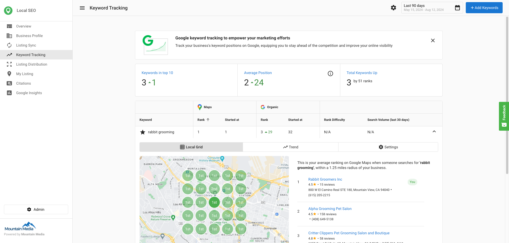

### Add keywords to track
1. Click `Add Keywords`.
2. Enter keywords (one per line).
3. Click `Add` to begin tracking.

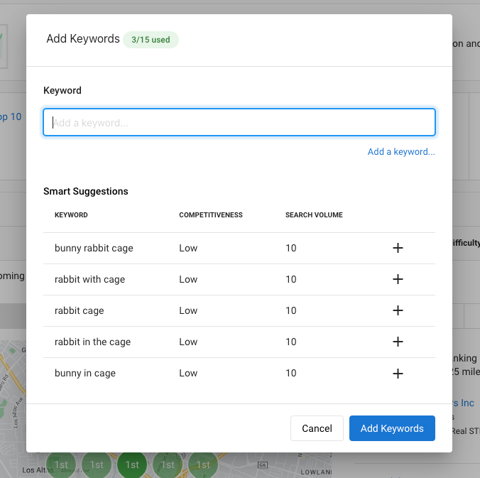

### View keyword data in the grid
The grid displays:

- `Position`: Current search position for the keyword
- `Best Position`: Highest position achieved
- `Change`: Difference since the last update
- `Local Monthly Search Volume`: Approximate local monthly searches
- `Competition`: Competition level (Low, Medium, High)
- `Last Updated`: Date of the last update

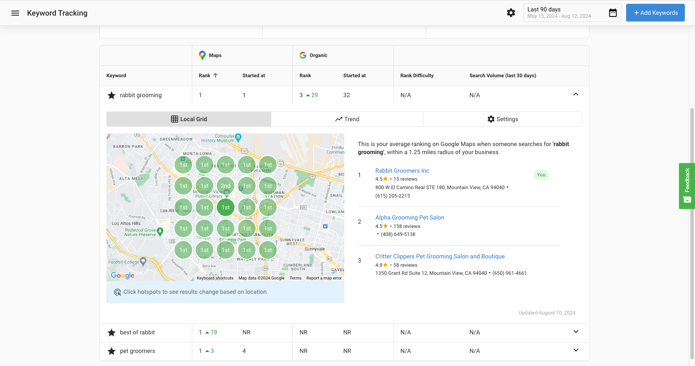

### Adjust keyword settings
1. Click the gear icon in the `Action` column for a keyword.
2. Select the desired action from the dropdown to adjust settings or remove the keyword.

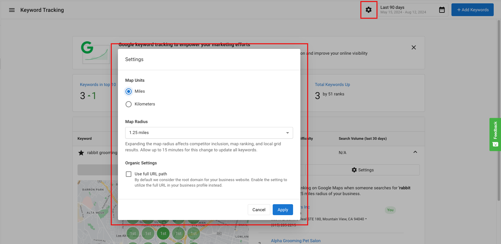

### Analyze keyword trends
1. Click the `Trend` tab at the top of the page.
2. Select a date range.
3. Hover over data points to view details for specific dates.

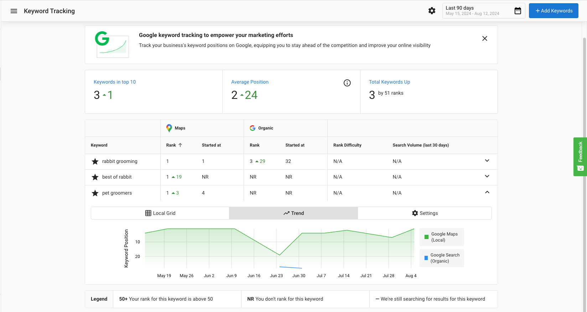

## Manage access to editing keywords and radius settings

You can disable editing of keywords for Business App-only users.

:::info
By default, editing is enabled for Business App users.
:::

To disable editing:
1. Open the Local SEO Admin Dashboard.
2. Go to `Product Settings`.
3. Toggle off `Allow SMBs to edit keywords`.

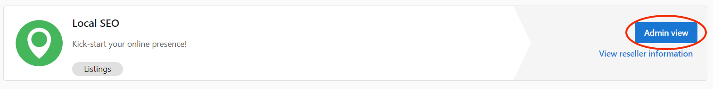

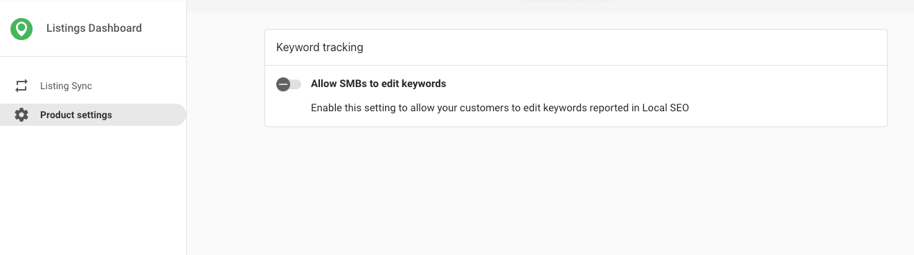

## SMART keyword suggestions

You can track SEO ranking on up to 15 keywords. Suggested keywords help you choose the terms that matter most.

How it works:

- Uses a business website as a seed to surface relevant alternatives.
- Considers competitiveness and search volume to highlight additional keywords to explore.
- Find suggestions at `Local SEO` > `Keyword Tracking` > `Add Keyword`.

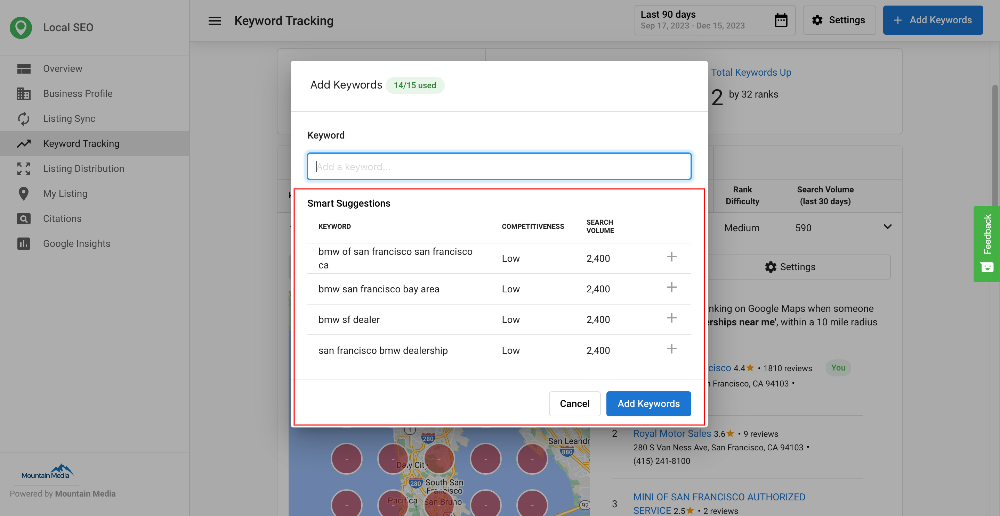

## SEO keywords in the executive report

You can select keywords to be synced (to sources that accept this data) and choose which ones to include in the Executive Report. This helps you monitor more keywords while reporting only on selected terms.

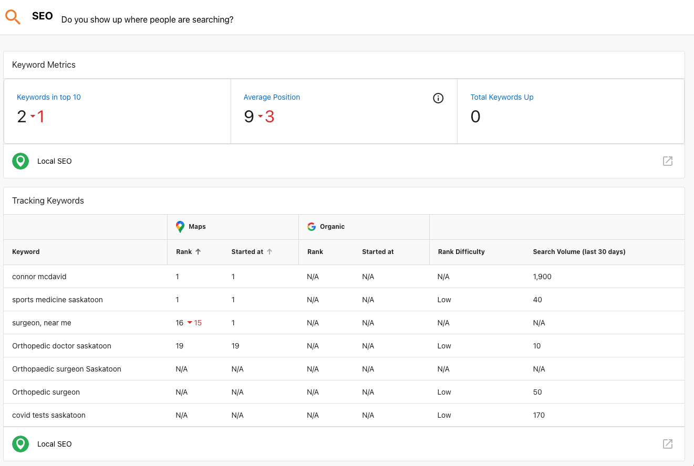

Examples and settings:

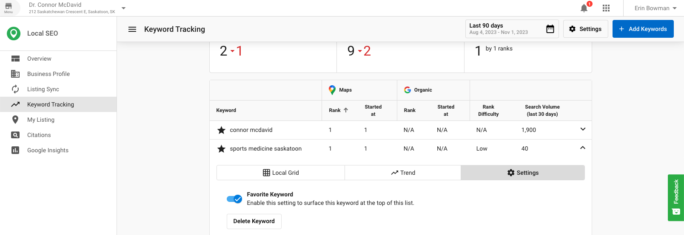

You can set the default for new keywords to be favorited or not.

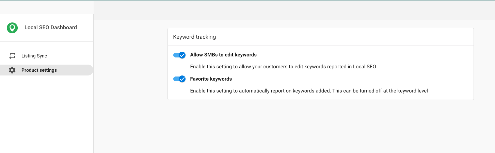

## Why are there no results in the Local SEO grid?

If the business is a Service Area Business (SAB), the issue might arise from a misalignment between targeted keywords and the address listed in the business profile.

How the map works:

- The listed business address is the center point for the map area used in Local Grid searches.
- If targeted keywords correspond to a region far from the listed address, no rankings will appear in the grid.

Workarounds:

1. Align keywords with the business address by focusing on the area surrounding the listed address.
2. Change the business address to a location closer to the targeted region. Important: This is not recommended and may impact listing accuracy.

### Additional context about keyword mapping
For Google Maps results, the system retrieves a maximum of 20 listings per search. If a business does not rank within the top 20 for an area, it appears as a blank red entry on the map. Organic search results do not use a radius setting. To get more detail, adjust the zoom level to focus on a smaller area.

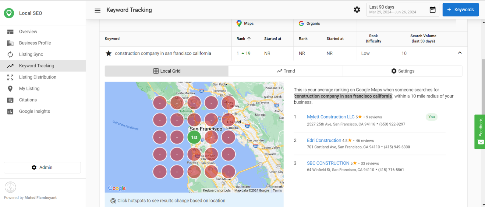

## Frequently asked questions (FAQs)

How do I access Keyword Tracking?

Open the Local SEO product and select `Keyword Tracking` from the left-hand menu.

How do I add keywords?

Click `Add Keywords`, enter terms (one per line), and select `Add`.

What data does the keyword grid show?

It shows `Position`, `Best Position`, `Change`, `Local Monthly Search Volume`, `Competition`, and `Last Updated`.

How do I change or remove a keyword?

Use the gear icon in the `Action` column to adjust settings or remove the keyword.

How do I view trends?

Open the `Trend` tab, choose a date range, and hover over data points.

Can I limit who can edit keywords?

Yes. You can disable editing of keywords for Business App-only users via `Product Settings`.

What are SMART Keyword Suggestions?

Suggestions use a website to propose related keywords and show competitiveness and search volume to evaluate them.

How many keywords can be tracked?

You can track up to 15 keywords. You can add more tracked keywords by activating the Local SEO add-on Additional Keywaords. Each activation of this add-on will add an additional 15 tracked keywords to your limit.

Where do I find keyword suggestions?

Go to `Local SEO` > `Keyword Tracking` > `Add Keyword`.

How do I include keywords in the Executive Report?

Select which keywords to include in the report and sync to sources that accept this data.

Why does the Local Grid show no results?

The targeted keywords may not align with the area around the listed address, especially for service area businesses.

How can I improve Local Grid results?

Align keywords with the business address. Changing the address may help but is not recommended due to potential listing accuracy issues.

Can I change the radius of the local SEO grid?

The map radius will default to 1.25 miles but can be easily changed by clicking on the "Edit Keywords" button in the top right. Choose from 1.25, 2.5, 5, or 10 miles for larger cites.

