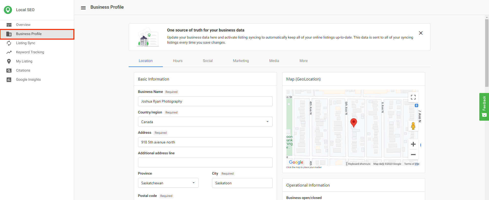
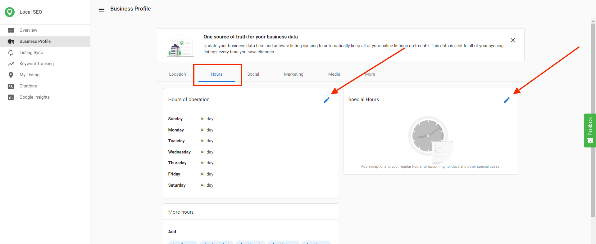

## What information syncs

Common fields that sync to multiple sources include:

- Company name
- Address
- Phone number
- Website
- Payment methods
- Services
- Brands / brands carried
- Hours of operation and special hours
- Logo / primary photo
- SEO keywords
- Instagram handle

For source‑specific details inside the product: open `Local SEO` > `Listing Sync` > choose a source > `Syncing Info`.

## Where to edit these fields

Use `Business Profile` in the product to update all fields that Listing Sync Pro syncs.

Update hours under the `Hours` tab.

## Score considerations

The listing score per source has a maximum attainable value, but there is no fixed maximum across all sources. Overall scores can change as sources are added or removed. You can see the per‑source maximum on the listings table under `Listing Sync`.

## Publisher lists and networks

- A current publisher list is available as a downloadable file: <a href="/files/Yext-publishers-2024.pdf" target="_blank" download>Publisher list (PDF)</a>.

