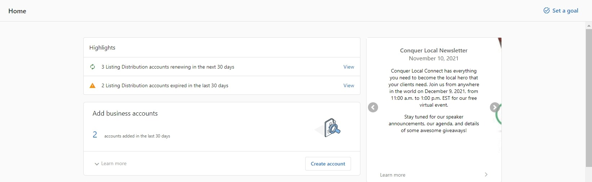

## Renewal visibility

Dashboards may surface locations that are approaching renewal so you can review coverage and plan renewals.

## What happens when you deactivate

- Listings become unmanaged by the syndication network and no longer receive updates through the product.
- Without active management, details can become outdated over time. Some sites also allow user suggestions on unclaimed listings.
- Outcomes vary by the specific services previously in use and the publishers involved.

For instructions to stop syncing immediately, see the `Stop listings from syncing` section in the Listing Sync overview.

