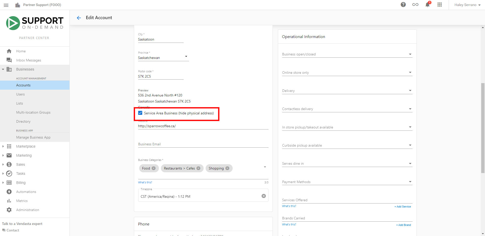

## Before you start

- Ensure accurate name, address, phone, website, and categories in `Business Profile`.
- Prepare a unique local phone number for the business.
- Use a physical street address (PO Boxes are not supported).

## Authentication

- Listings managed by Listing Sync Pro generally do not require you to authenticate accounts on supported directories.
- For direct social or map connections (outside the managed network), authentication is required within those platforms.

## Claiming profiles

- Google Business Profile must be claimed directly through Google. This product does not claim Google profiles on your behalf.
- Prioritize claiming major sources such as Google, Bing, Yelp, and Yellowpages. A step‑by‑step playbook is available here: `/files/listing-sync-pro/The_Big_4_Playbook.pdf`.

## Address and PO boxes

- Using a PO Box as the business address prevents syncing. Enter a street address instead. If you prefer to hide the address publicly, select the service‑area business option where supported.

## Shared phone numbers or addresses

- A unique local phone number is critical. Directory networks and aggregators use this for matching. Reuse of a phone number across businesses can prevent syndication.
- Address data is validated against authoritative postal sources to avoid duplication.

## Where to view listings information

- The external network dashboard is not accessible from the Business App.
- To view listings information, open `Local SEO` > `Listing Sync` inside the product.

