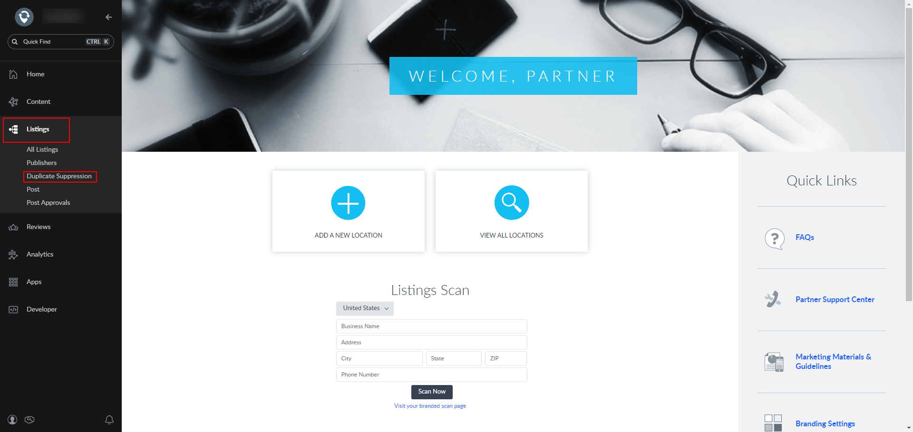
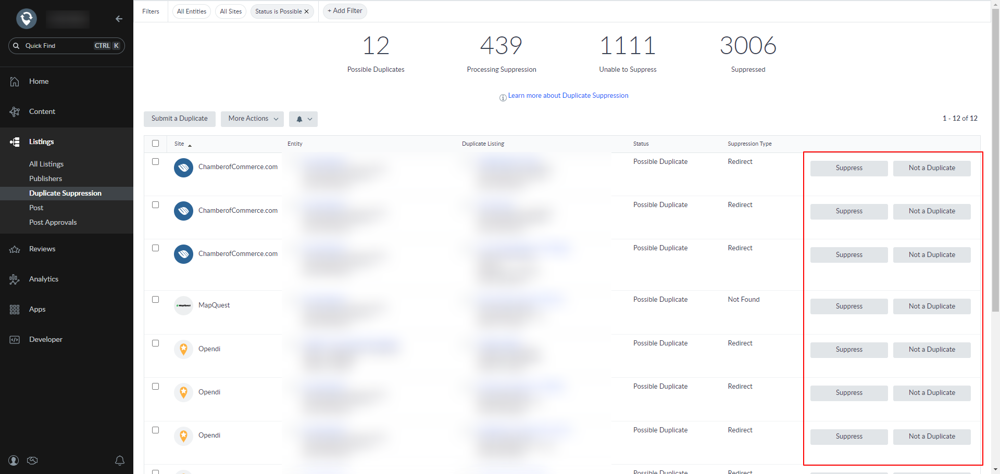
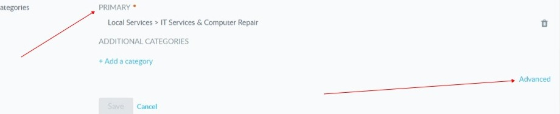
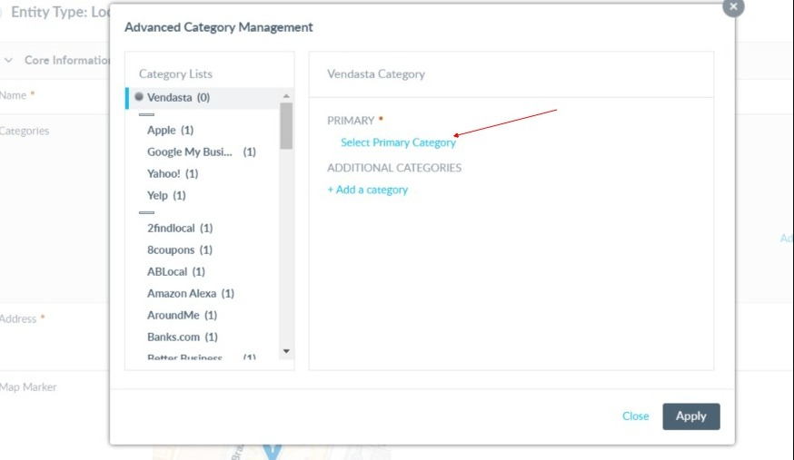

## Status: submitted to source (aggregator)

Some sources function as aggregators. The system submits your data to the aggregator, which then distributes it to their network. Publication timing depends on the aggregator and downstream sites. In these cases, confirmation reflects submission/acceptance rather than live publication timing.

## Manage duplicate listings

If duplicates are detected by the managed network dashboard, you can review and suppress duplicates. Suppression requests are reviewed by the publisher; many resolve within 24 hours, while others may take up to a week or longer. Suppressed listings are typically removed from search results or redirected to the correct profile.

### Will Listing Sync Pro create duplicate listings?

The product should not create duplicate listings. If you find duplicates, use the duplicate‑suppression workflow above to resolve them.

## Blocked categories (service‑area business types)

Some service‑area business categories cannot create new listings on certain publishers due to verification and spam‑prevention policies. Examples include locksmiths, garage doors, and movers. Existing listings may still be claimed. If categories maintained in the business profile do not match a network dashboard, syncing can fail until aligned.

See also: set primary and additional categories in `business-profile`.

## Activation error: existing incompatible service

If you see an activation error indicating the account has an existing incompatible service, the existing relationship with the network must end before activation can proceed. The business owner must contact the network’s support address to request termination of the conflicting relationship.

