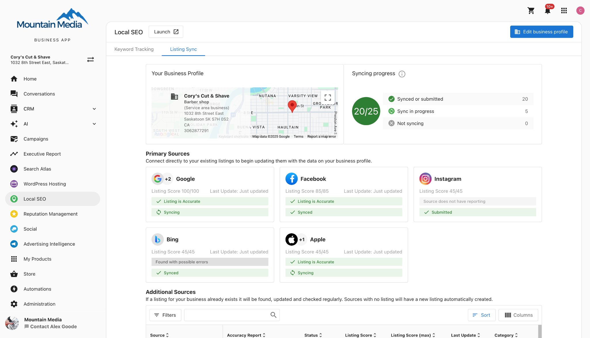
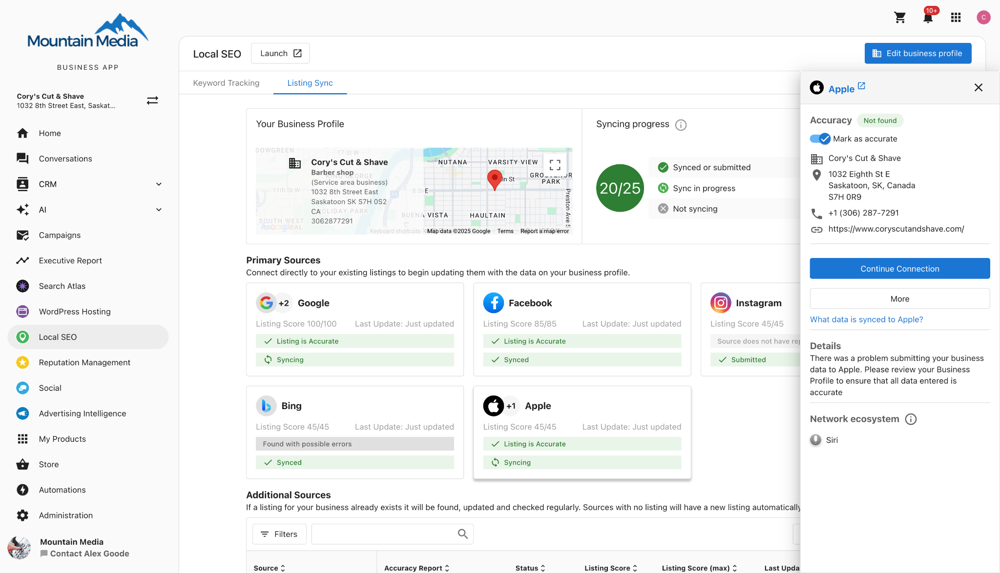
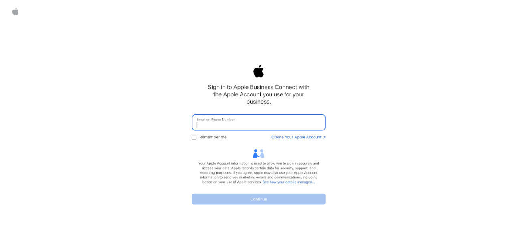
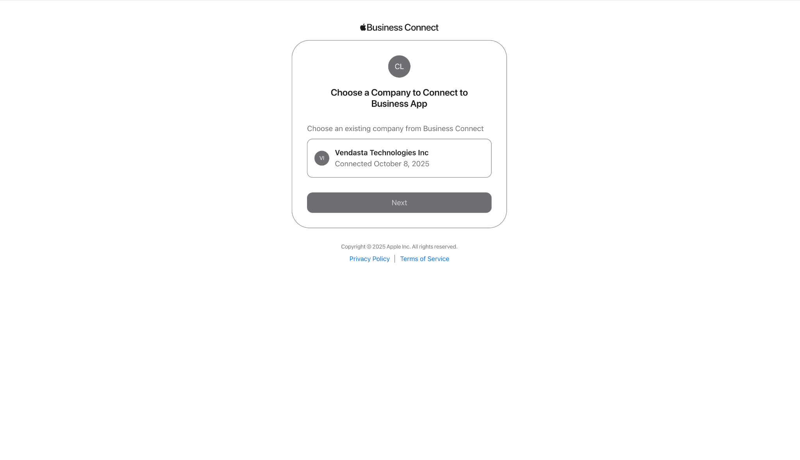
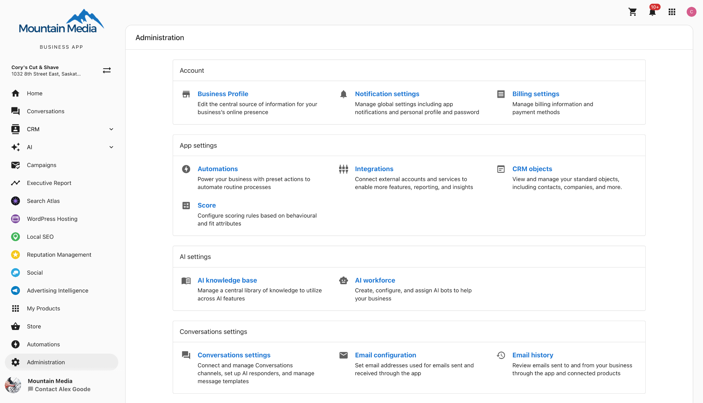
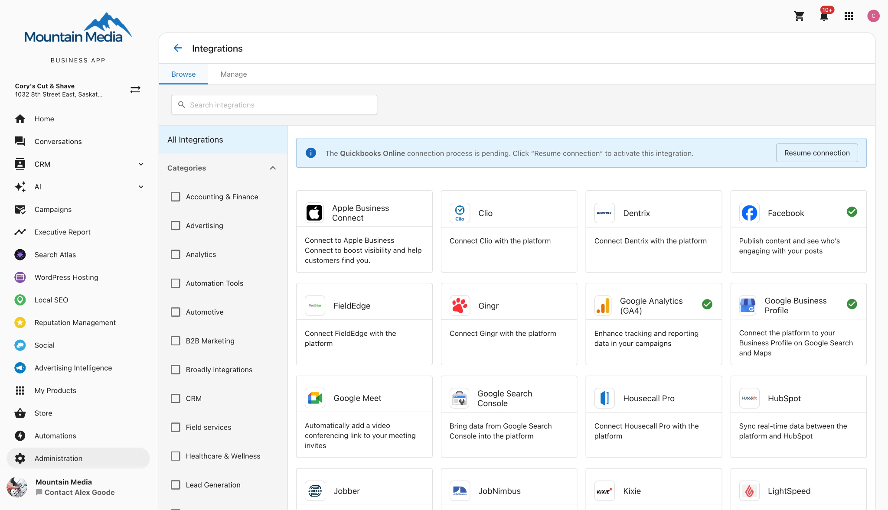
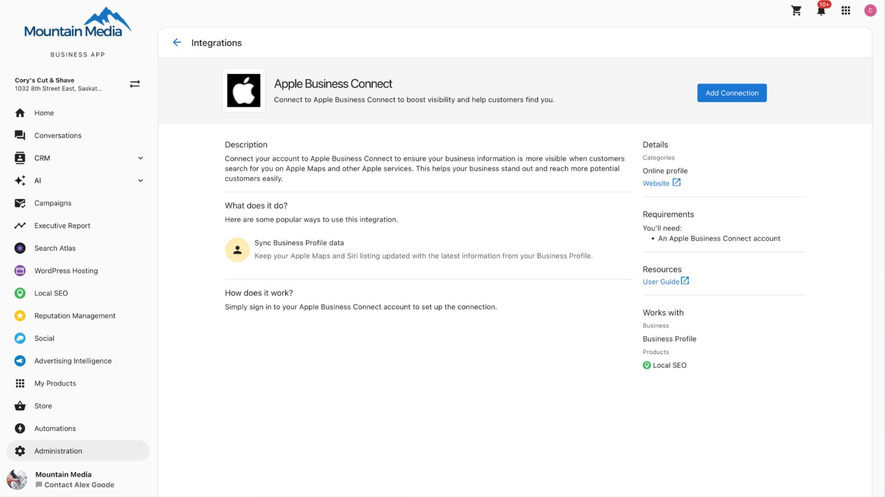

import Tabs from '@theme/Tabs';
import TabItem from '@theme/TabItem';

## What is Apple Business Connect and How Does It Work?

You can connect and authenticate your Apple Business Connect listing with Local SEO through an integrated workflow with [Apple Business Connect](https://businessconnect.apple.com/?campaignId=8018). This allows for direct data syndication to Apple's ecosystem, improving visibility and trustworthiness of your business information on Apple Maps, Siri, Wallet, Messages, and more.

## Why Apple Business Connect Matters for Local SEO and Business Visibility

Connecting your Apple Business Connect listing offers several advantages for your business:

- **Higher Data Accuracy**: Manage your phone number, email, addresses, website, hours, and more to have accurate and consistent data across Apple apps.                                                               
- **Greater Visibility**: Claimed businesses get 30% more views. Add your logo, cover photo, photos of your business, and more to help your place card stand out.                                                      

## What's Included with Apple Business Connect?

Connecting your listing enables:

- Syndication of verified data to Apple's services.
- Branding and customization of your Apple Maps place card.
- Automatic syncing of updates made in Local SEO.

## How to Claim Your Apple Listing

Before you connect your listing, you must claim it. Here are the steps to claim your business's Apple listing:

1. Go to [Apple Business Connect](https://businessconnect.apple.com/?campaignId=8018) and register.
2. Add information about the owning organization (e.g., legal entity or parent company).
3. Add your brand.
4. Verify the business using official documents like a utility bill or lease.
5. Claim or add your business's location and address.
6. Update or add details such as your business category, phone number, and website.
7. Add your logo, a cover photo, and other brand content to enhance your business's presence.
8. Set your typical business hours.

## How to Connect Apple Business Connect

Once your listing is claimed, you can connect it through either Local SEO or the Business App.

<Tabs>
  <TabItem value="localseo" label="Option 1: Via Local SEO">

1. Navigate to the `Listing Sync` tab.

    

2. Select the Apple listing card and click `Connect Now`.

    

3. Sign in to Apple Business Connect using the email or phone number associated with the Apple Business Connect account.

    

4. Select a company to connect.

    

5. You will be automatically redirected back to Local SEO.

  </TabItem>
  <TabItem value="businessapp" label="Option 2: Via Business App Integrations">

1. Go to the `Administration` tab.

    

2. Click on `Connections` and select `Apple Business Connect`.

    

3. Click `Add Connection`. You will be redirected to Apple Business Connect.

    

4. Sign in to Apple Business Connect using the email or phone number associated with the Apple Business Connect account.

    

5. Select a company to connect.

    

6. You will be returned to the Apple Business Connect page within the Business App.

  </TabItem>
</Tabs>

After successful authentication, your verified business information will be synced automatically, ensuring your presence across Apple applications is accurate and up-to-date.

## Frequently Asked Questions (FAQs)

Does Apple Business Connect support businesses with multiple locations?

Yes. Apple Business Connect supports multi-location businesses and offers a brand portal for large chains and enterprises. Through Local SEO's integration with Apple Business Connect, each location can be managed from a single dashboard while syncing reliably to Apple Maps. This allows scaling from a few stores to hundreds without managing multiple Apple Business Connect accounts separately.

How does Apple Business Connect benefit my business or clients?

Apple Business Connect ensures accurate, consistent information across Apple Maps, Siri, Apple Wallet, and other Apple apps, which is used by billions of Apple users daily. With Local SEO's integration with Apple Business Connect, updates sync automatically across the entire Apple ecosystem. Apple Business Connect listings can include photos, logos, and action buttons such as Book Now. Apple Business Connect also provides valuable insights showing how people find and interact with a business through Apple Maps and Siri, offering more visibility into online presence and customer behavior.

How can I manage and update my business info across so many listing sites?

Manually updating each platform is possible but not scalable. Tools like Local SEO and Listing Sync Pro allow for updates to be made once and pushed to 50+ directories in real time, including Apple Maps and other major platforms. These tools also monitor accuracy, correct unauthorized changes, and flag duplicates, ensuring consistency across platforms like Apple Business Connect, Google Business Profile, and social media listings.

What are some best practices for local listings?

- Claim and verify major listings (Apple Business Connect, Google Business Profile, Facebook, Bing, key industry sites).
- Keep information consistent (name, address, phone, website) across all platforms including Apple Maps and Apple Business Connect.
- Complete profiles with categories, hours, photos, and services, taking advantage of Apple Business Connect's enhanced features like branded place cards.
- Update promptly when details change; tools like Listing Sync Pro can update in real time across Apple Business Connect and 50+ other directories.
- Monitor and fix duplicates to avoid confusion, especially across Apple Maps and other Apple ecosystem services.
- Encourage and respond to customer reviews on all platforms including those visible through Apple Maps and Siri.
- Use special platform features (e.g. Apple Showcases, Google posts, Apple Business Connect custom actions).
- Apply a consistent multi-location strategy that works across Apple Business Connect's enterprise tools and Local SEO's management dashboard.
- Audit regularly to catch errors and track improvements across your Apple Business Connect presence and other listings.

Which products include Apple Business Connect syncing, and does it cost extra?

It is included in the below product with no additional cost:

- Local SEO Pro
- Local SEO (Standard) + Listing Sync Pro
- Listing Sync Pro (Yext)

