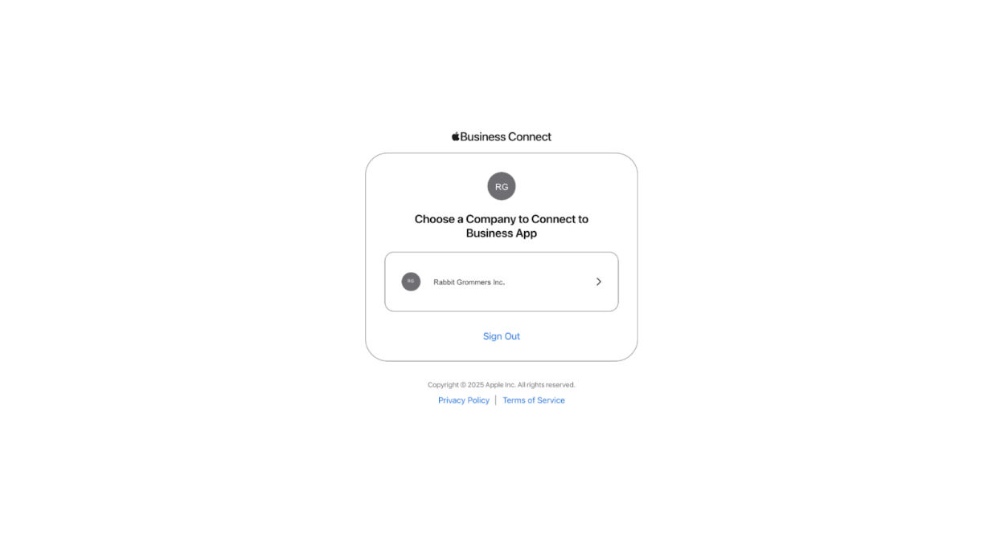
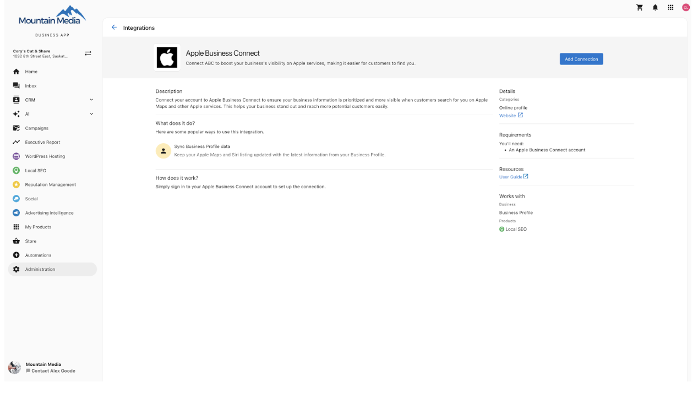
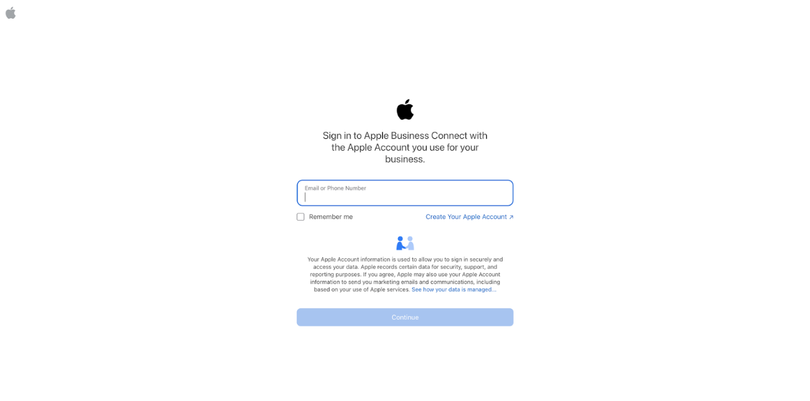
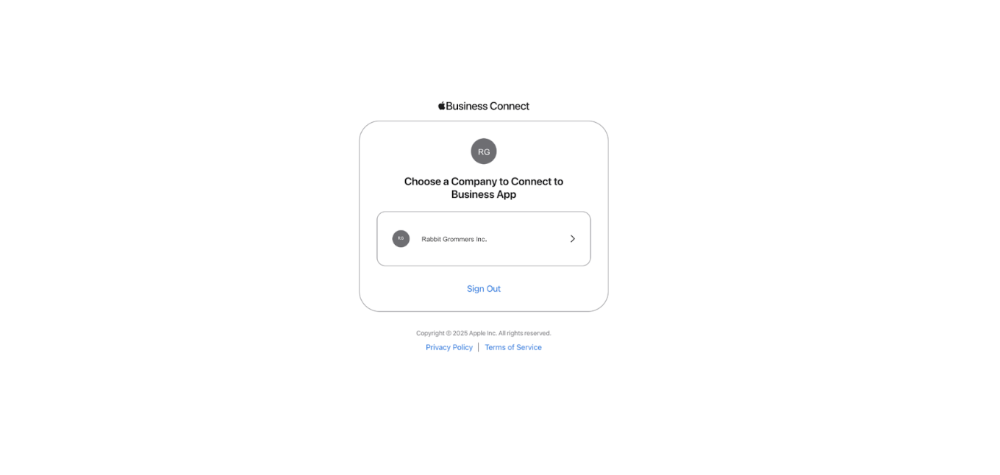
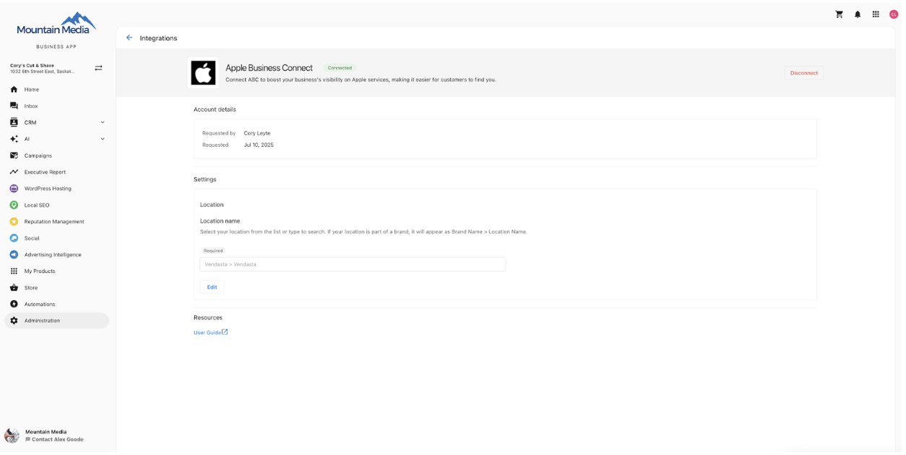

# Connect and Authenticate Your Apple Business Listing with Local SEO

## Overview

You can connect and authenticate your Apple Business listing with Local SEO using a secure OAuth workflow through Apple Business Connect. This integration enables direct data syndication to Apple’s ecosystem, ensuring your business information is accurate and up-to-date across Apple Maps, Siri, Wallet, Messages, and other Apple services.

## Benefits of Connecting Your Apple Listing

- **Data Accuracy**: Manage and sync your business information, including phone number, address, hours of operation, website, and more, to ensure consistent data across Apple platforms.
- **Increased Visibility**: Claimed businesses typically receive more views. Adding visual elements such as logos, cover photos, and business imagery helps your listing stand out in Apple Maps search results.

## How to Claim Your Apple Business Listing

Before connecting your listing in Local SEO, your business must first be claimed through Apple Business Connect. Follow the steps below to complete the claiming process:

1. 1. Visit [Apple Business Connect](https://businessconnect.apple.com/?campaignId=8018) and register for a free account.
2. Add your business location and address.
3. Enter key business details, including category, phone number, and website.
4. Upload brand elements such as your logo, cover photo, and additional images.
5. Set your regular business hours.
6. Provide information about the organization that owns the business (e.g., legal entity or parent company).
7. Complete the verification process by submitting a document such as a utility bill, business license, or lease agreement.

Once verified, you can proceed to connect your listing through Local SEO or Business App.

## Connecting via Local SEO

1. Open the **Local SEO** product and navigate to the **Listing Sync** tab.
2. Locate the Apple listing card and select **Connect Now**.
3. Sign in to Apple Business Connect using the email or phone number associated with the Apple Business Connect account.

4. Select the business entity you wish to connect.

5. You will be redirected back to Local SEO, and the sync will be completed.

## Connecting via Business App

1. Open the **Business App** and go to the **Administration** tab.
2. Select **Connections**, then choose **Apple Business Connect**.
3. Click **Add Connect** to begin the authentication flow.

4. You will be redirected to Apple Business Connect to sign in using the email or phone number associated with the account.

5. Select the business entity you wish to connect.

6. You will return to the Business App’s Apple Business Connect page once the connection is established.

## What Happens After Authentication

After successfully connecting your Apple Business listing:

- Your verified business data will sync with Apple automatically.
- Updates to your business profile (such as address, phone number, or hours) will be reflected across Apple’s platforms.
- Visual and business information will appear on your Apple Maps place card and other Apple services.
- Your business benefits from increased visibility and improved trust signals on Apple devices.

## Additional Notes

- Make sure you have appropriate administrative access to the Apple Business Connect account before starting the connection process.
- Only one Apple Business Connect account can be linked per business location.
- Regular updates to your business profile in Local SEO will help maintain consistent and accurate listings across all directories, including Apple.
