# Listing Sync

## What is Listing Sync?

Listing Sync allows you to instantaneously sync common business data to your Google Business Profile, Facebook, Bing, and X profiles to ensure the accuracy and consistency of your contact info. This helps improve SEO and customer acquisition while reducing the time it takes to update multiple online profiles.

## Why is Listing Sync important?

- **Increased visibility**: People use online maps and directories daily to find businesses. By keeping your listings up to date, you can attract more local customers.
- **Accurate information**: Consistent business details help customers find you and trust the information they see.
- **Enhanced features**: You can add details like logos, cover images, and action links on supported directories to make your listing stand out.

## What’s included with Listing Sync?

You can sync the core data that helps customers find you:

- **NAP data**: Name, Address, Phone number
- **Website URL**
- **Attributes**: Payment methods, business logo, primary photo, long/short descriptions, and social media URLs

Each directory decides which attributes to display.

## How to set up Listing Sync

1. Go to `Local SEO` and open the `Listing Sync` tab.
2. Click `Connect` next to a source.
3. Enter your login credentials for that source.
4. Click `Allow` or grant permissions for the source to sync.
5. Select the business location or page to connect.

## Multiple social connections

If you connect multiple Facebook, Instagram, or X pages through Business App or other connected products, you can choose which page Listing Sync updates.

How to select a page:

1. In `Local SEO`, open the `Listing Sync` tab.
2. Click the desired source.
3. In the side panel, choose which connected page to sync to.
4. Click `Sync to`.

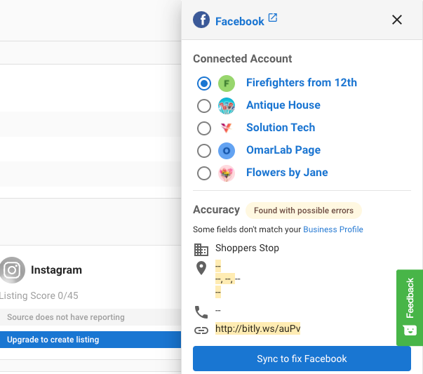

:::info
The Instagram source selection does not have an edit button because it is managed by the Facebook source selection.
:::

## Service area businesses

- If you mark a business as a Service Area Business in the Business Profile, the system will still attempt to match and pull listings into the platform.
- If an external source’s address matches your Business Profile, it appears as an accurate listing.
- If the address does not match, it appears as “listing found with possible errors,” and you must edit it on the external source.

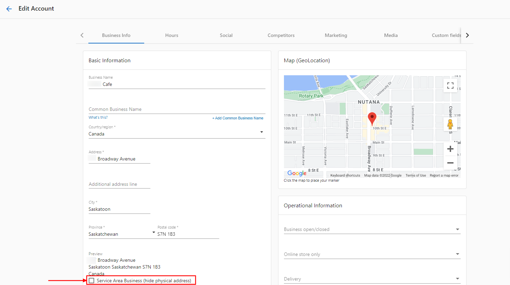

## Improve your listing score

To get the most value from Listing Sync:

- Fill out your Business Profile completely and ensure the information is 100% accurate.
- Select a primary category and two secondary categories.
- Keep your Google Business Profile optimized every month.
- Ensure the business address is searchable with a quick online search.
- Ensure the phone number is accurate.

## Listing Sync timeline

- Most sources receive submissions within 15 minutes to 1 hour.
- Listings can take up to 4 weeks to publish across the network.
- Upon initial activation, allow 6–8 weeks for all sources to sync.
- Directories have different update cycles. Allow 24–72 hours for updates before troubleshooting.
- GPS directories can take up to 30 days.
- Bing and Apple Maps can take longer because they also pull data from other sources.
- Some directories require data cleansing (reformatting business name, address, and latitude/longitude), which adds time.
- Directories with mandatory cleansing include Apple, Yelp, Foursquare, Baidu, and HERE.
- If a listing remains in a `syncing` status for over 4 weeks, contact support with the account name and the specific source.

## Accuracy report

The `Accuracy Report` column reflects independent reporting on data submitted to directories. When you add a source, the system pushes your Business Profile data to that directory. The directory can communicate back that the data was accepted, rejected, or published. The Accuracy Report shows these results.

### Accuracy report statuses

- **Accurate**: There is a 100% match between your Business Profile data and the listing source. Some directories require cleansing, which can cause the report to differ from your raw Business Profile data. Mandatory cleansing directories include Apple, Yelp, Foursquare, Baidu, HERE, and Tripadvisor.
- **In progress**: The listing data is being updated on the source. This status can persist for some time.
- **Not found**: The system did not find a good listing match.
- **Source does not have reporting**: The system cannot verify whether data was updated because the directory cannot communicate a status back. GPS sources commonly show this. Data submission is when data is pushed to the directory, while data collection is when systems explore the internet to verify updates; some sources do not support robust data collection.

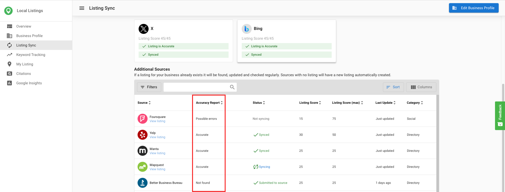
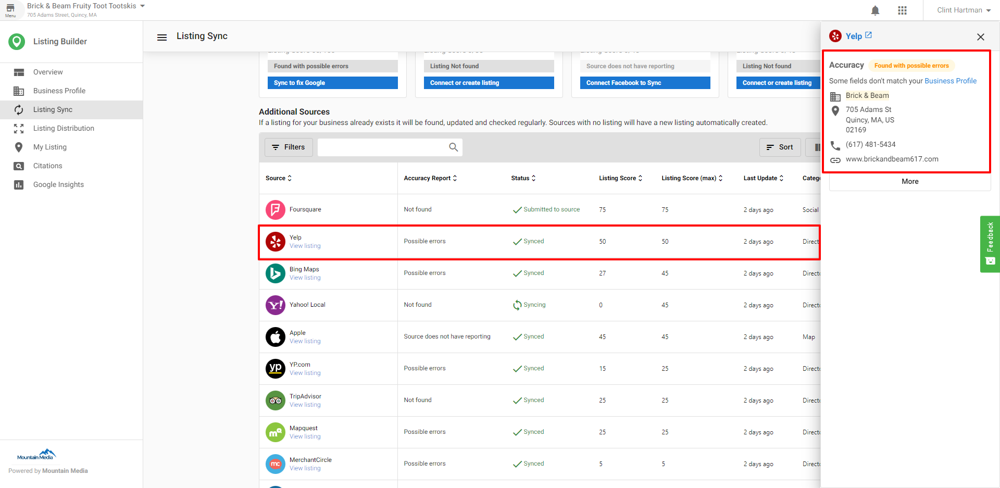
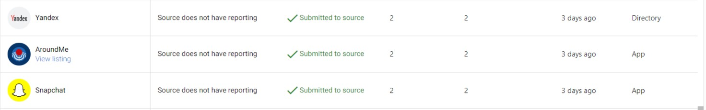

## Listing statuses

- **Submitted to source**: The system submitted your Business Profile information to the directory. Each source controls its own publishing timeline. Allow 24–72 hours for most sources, up to 30 days for GPS directories. Bing and Apple Maps can take longer. Voice sources are submission-based and may take longer.
- **Synced**: The directory reported back that the listing was updated. The `Accuracy Report` then shows the accuracy of that data. If it shows `Accurate`, the listing is live with 100% data accuracy.
- **Not syncing**: The business may have a paid advertising relationship with the source that blocks updates from the system.

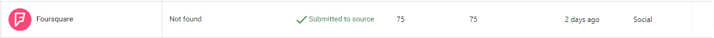
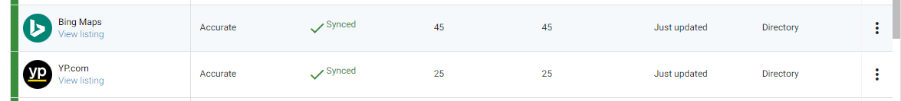
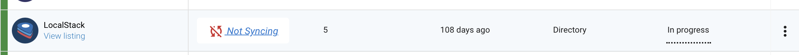

### Claimed listings

When a listing is marked as claimed, someone controls it. Claimed listings are verified by the owner through a paid relationship with the site or via a third‑party syncing service. Only the verifier can maintain it. Listing Sync cannot manage claimed listings. If you want Listing Sync to manage them, you must contact the listing site or service provider and ask them to release the listings.

:::info
"As I am managing my business online listings through a technical service provider, I kindly ask you to release the listing -(insert link here)- or completely delete it, so that my business data can be automatically submitted and updated onto your directory. Please inform me as soon as the optimization of my online presence can be resumed. Kind regards, YOUR NAME".
:::

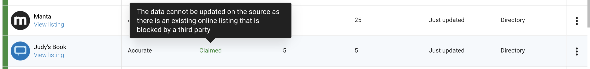

## Stop listings from syncing

- If Listing Sync Pro is active, syncing continues until the billing cycle ends, even after cancellation.
- To stop syncing immediately, cancel the product, then click `Force deactivation` in the menu.
- You can turn sync on/off for Google, Facebook, Instagram, or X by clicking the sync button for each source, then `More > Turn off Syncing`.
- Turning off sync for Facebook also turns off Instagram.

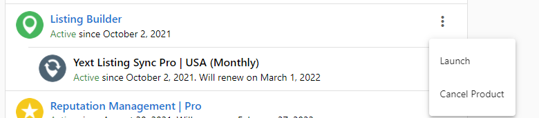
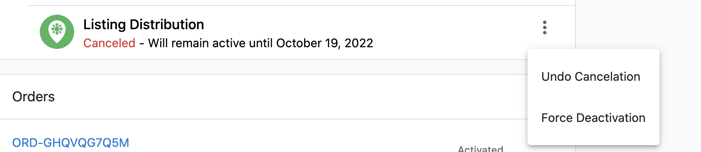

### Force deactivation steps
1. Open the account and locate the cancelled add-on under `Products`.
2. Click the kebab menu and choose `Force deactivation`.
3. In the confirmation, select `Deactivate now` to proceed.

Forcing deactivation removes the add-on and ends syndication services. Billing continues until the end of the commitment.
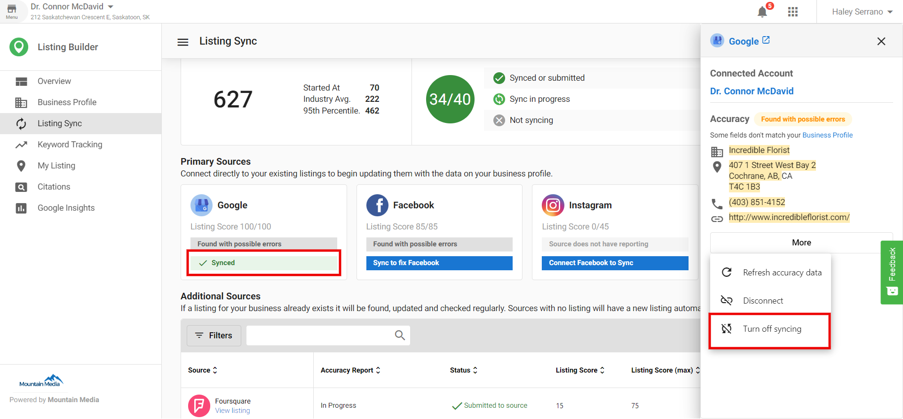

## Special hours on Apple

- Apple displays Holiday Hours as `Special Hours` for a 7‑day timeframe if you are within 4 days of the holiday.
- Updates made in Yext can take up to a week to display on Apple Maps. Apple allows a maximum of 50 holiday hour entries.
- Apple does not display all special hours for the entire year at once.

## Bing duplicate listing alternative

You cannot suppress duplicates on Bing, but you can suggest an edit to downgrade and possibly remove duplicates:

1. Open the Bing listing that should be removed.
2. Click the three dots in the top-right corner.
3. Select `Suggest an edit`.
4. Choose `Remove this place` and mark it as closed, nonexistent, or duplicate.

The more people who submit the suggestion, the faster the wrong entry may be downgraded.

## Columns and actions in Listing Sync

### Category column

The `category` column shows the type of directory source:

- **Directory**: An online listing directory
- **Map**: Sites with online maps (for example, mapping services)
- **Social**: Social media networks
- **Aggregator**: Publishers that push their listing information to other sources
- **App**: Standalone applications that are not GPS services
- **GPS**: Sources that power GPS applications

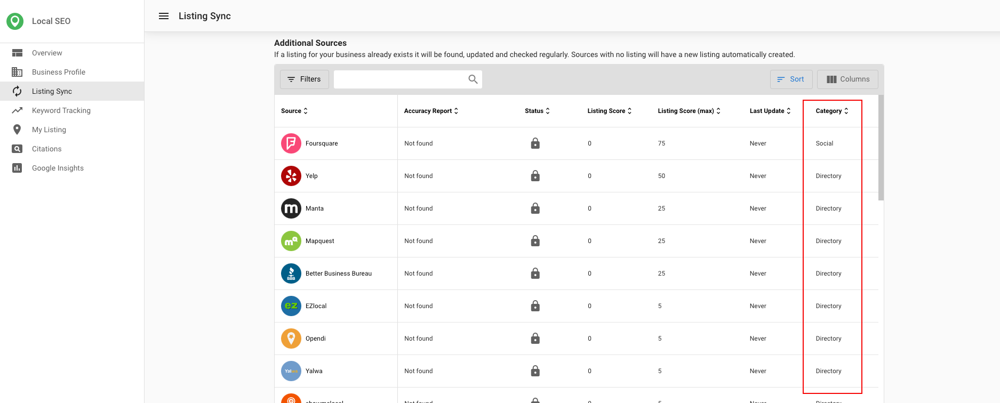

### What data is synced to each source

- Google: Business name; street address, zip/postal code, city, state (street address and zip/postal code are hidden for service area businesses); phone number; website URL; hours of operation and special hours; Google attributes.
- Facebook: Street address, city, state, zip code (street address and zip/postal code are hidden for service area businesses); phone number; website URL; hours of operation; payment methods; logo.
- X: Street address, city, state, zip code (street address and zip/postal code are hidden for service area businesses); website URL; logo; short description (if less than 160 characters).
- Instagram: Street address, city, state, zip code.
- Bing: Business name; street address, zip/postal code, city, state (street address and zip/postal code are hidden for service area businesses); website URL; logo; Bing attributes; primary phone number; regular hours of operation.

### Last update column

The `Last Update` column shows the last time the system pulled data from the internet for that listing.

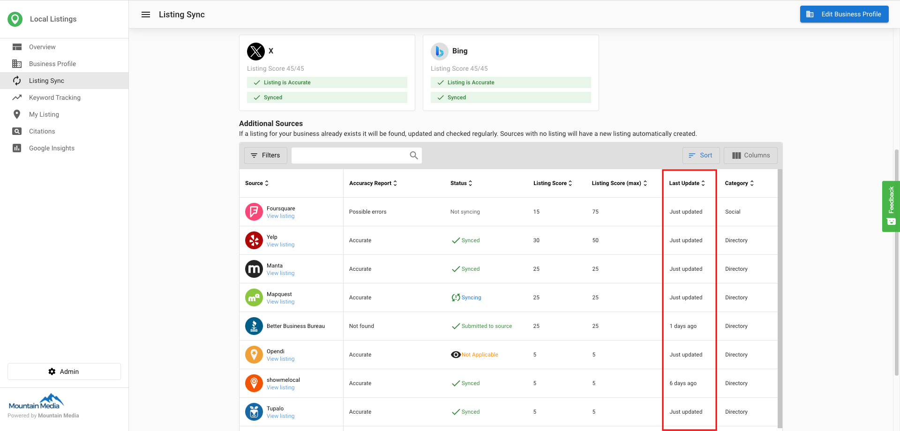

### Refresh listing button

Use `Refresh Listing` to get an updated state of your listing. This updates the `Accuracy Report` if the system finds new information.

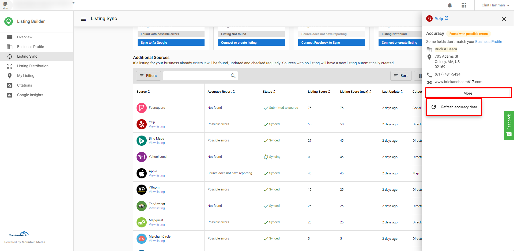

## Frequently asked questions (FAQs)

What is a claimed listing?

When a listing is marked as claimed, someone controls it. Claimed listings are verified by the owner through a paid relationship with the site or via a third‑party syncing service. Only the verifier can maintain it. The service cannot manage claimed listings unless the listing source releases control.

How do I stop listings from syncing?

Syncing continues until the billing cycle ends. To stop immediately, cancel the product and click Force deactivation. You can also turn sync on/off per social source; turning off Facebook also turns off Instagram.

What does the status “Submitted to source” mean?

Your data was submitted to the directory. Publishing timelines vary by source; allow 24–72 hours for most, up to 30 days for GPS directories. Bing and Apple Maps can take longer. Voice sources may also take longer.

What does the status “Synced” mean?

The directory reported that your listing was updated. Check the Accuracy Report for the data match. If it shows Accurate, the listing is live with a 100% match.

What does the status “Not syncing” mean?

The business may have a paid advertising relationship with that source, which blocks updates.

What does the Accuracy Report show?

It reports whether a directory accepted, rejected, or published your submitted data, and whether the live data matches your Business Profile.

What do the Accuracy Report statuses mean?

Accurate: 100% match. In progress: updating on the source. Not found: no good match. Source does not have reporting: the source cannot communicate status back.

How long does syncing take?

Submissions occur within 15 minutes to 1 hour. Publishing can take up to 4 weeks, and initial activation can take 6–8 weeks for all sources. GPS sources can take up to 30 days.

What if my listing has been syncing for over 4 weeks?

If the listing has been in a "syncing" status for over 4 weeks, contact support with the account name and the specific source.

How are Service Area Businesses handled?

The system attempts to match and pull listings. If the external source address matches your Business Profile, it appears as accurate. If not, it appears with possible errors and needs edits on the external source.

Can I remove duplicates on Bing?

You cannot suppress duplicates directly. Use Suggest an edit on the listing and select Remove this place to mark it as closed, nonexistent, or duplicate.

Do special hours sync to Apple?

Apple displays special hours within 4 days of the holiday for a 7‑day timeframe. Updates can take up to a week to show, with a maximum of 50 holiday hour entries.

