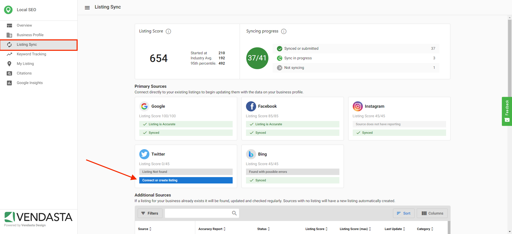
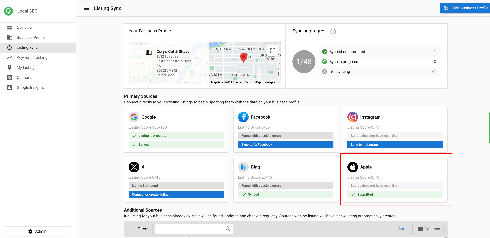

# Listing Sync

Listing Sync is a feature within Vendasta's Local SEO product that enables businesses to manage and synchronize their business information across multiple online platforms, directories, and search engines.

## What is Listing Sync?

Listing Sync allows businesses to instantaneously sync common data to their Google Business Profile, Facebook, Bing, and X profiles to ensure the accuracy and consistency of their contact info. This feature makes it easier to improve SEO and customer acquisition while reducing the time it takes to update multiple online profiles.

## Getting Started

### How to Set Up Listing Sync

1. Navigate to **Local SEO > Listing Sync**
2. Click on "Connect" next to a source
3. Enter your login credentials for that source
4. Click on "Allow" or grant permissions for the source to sync
5. Select a business location/page to connect

### Sync Timeline and Expectations

The majority of listing sites will be submitted to the listing source instantaneously (15 minutes to an hour), but listings can take up to **4 weeks** to be published across our network of listing sources.

**Upon initial activation of Listing Sync Pro, please allow 6-8 weeks for all sources to sync.**

All listing directories have different updating cycles. Please allow the directories 24-72 hours to process the update before attempting to troubleshoot the listing. GPS directories (Audi, BMW, etc.) can take up to 30 days. Bing and Apple Maps can take longer as they are aggregators and pull data from other sources in addition to the data we send to the directory.

If the listing has been in a "syncing" status for over 4 weeks, please contact support with the account name, and specific source.

## Core Features

### Apple Business Listings

**Sync your client's business listing information to Apple directly from Local SEO Pro**

Syncing your client's business with Apple through Local SEO is a great way to ensure the business information is accurately represented on Apple Maps and other Apple services. This integration helps businesses enhance their visibility and reach millions of potential customers using Apple devices.

#### Why are Apple Listings important?

1. **Increased Visibility**: Apple Maps is used by millions of people daily to find businesses and services. By listing your business, you increase the chances of attracting local customers.
2. **Accurate Information**: Ensuring your business details are correct on Apple Maps helps potential customers find you easily and trust the information they see.
3. **Enhanced Features**: Apple listings synced through Local SEO allows businesses to add additional details like logos, cover images, and custom action links to their listings, making them stand out.

#### How do Apple Listings Work?

1. **Data Synchronization**: We send your business information to Apple, ensuring only the most recent and accurate data is included. This helps maintain the integrity of your listing.
2. **Confidence Score**: Apple uses a confidence score to determine the accuracy of the data. If the confidence score is high, your information is more likely to be displayed prominently. Apple verifies data against the business website, so make sure the website is up to date before syncing to Apple.
3. **Automatic Updates**: Changes to the Business profile are pushed to Apple automatically, keeping your Maps listing up to date.

#### How to start syncing with Apple

1. Navigate to **Partner Center > Accounts > Manage Accounts > Select an account** (The account must have Local SEO Pro).
2. Go to the Listing Sync tab.
3. From here, you will see the Apple card.

*Please note that Apple does not accept Service Area Businesses.*

### Service Area Business Listings

If you have checked Service Area Business in the address section of a client's Business Profile, our system will continue to attempt to make a match to your business listing and pull them into our platform.

If the address on an external listing source accurately matches the information you have listed in the Business Profile it will be pulled into our platform and marked as an accurate listing.  

If the address does not match what is on the listing source, the listing will be marked as a 'listing found with possible errors' and will need to be edited on the external source.

:::note
**Please note:** If a business is listed as a service area business on the Google Business Profile directly, it will **not** be found by Reputation Management, and therefore **will not pull into the Snapshot Report**. This is due to a limitation with the Google API that powers our listing search.

To have the Google listing pulled into the Snapshot Report, please connect it directly in Reputation Management.
:::

### Multiple Social Connections

Clients with multiple Facebook, Instagram, or X pages connected to the platform can view and select exactly which social page the data syncs to. Please note that the Instagram source selection does not have an edit button because it is managed by the Facebook source selection.

#### How do Multiple Social Connections work in Local SEO?

If a client has connected multiple social pages through the Business App or a product like [Reputation Management](/vendasta-products/reputation-management) or [Social Marketing](/vendasta-products/social-marketing), they will see those accounts reflected in [Local SEO](/vendasta-products/local-seo).

On the Listing Sync tab found within Local SEO, click on the desired source. From here, the side panel will appear, and you can select which of the connected pages you would like to sync to. Select the 'Sync to' button, and you are set!

### Bing Listing Suppression Alternative

Bing does not support listing suppression, meaning that any duplicate listings will not be removed. Although Bing does not support listing suppression, there is an alternative way to have duplicate listings downgraded and possibly removed.

To do this, navigate to the Bing listing that needs to be removed, and click to open the listing window. Next, click the three dots in the top right-hand corner, and select "Suggest an edit."

From here, you can select "remove this place" to have the listing marked as closed, nonexistent, or duplicate.

By doing this, the listing may be displayed less frequently, and the correct listing will likely come up first.

**NOTE: The more people that do this, the faster the wrong entry in Bing will be downgraded.**

## Managing Your Listings

### How to Increase Your Listing Score

In order to get the most value out of Listing Sync Pro, make sure your Business Profile data is filled out completely and 100% accurate. Ensure you select a primary category as well as two secondary categories. Ensure your Google Business Profile stays optimized every month. You can do this on behalf of your client or you can do this through a managed service like [Google Business Profile Optimization](https://partners.vendasta.com/marketplace/products/MP-6GLFKDNCV3LTHTRZ6DDXLJN7MLVBBWGW). Ensure the client's business address is searchable by doing a quick Google search of their address. Ensure the phone number is accurate.

Our system syncs data that helps your clients get found, like NAP data (Name, Address, Phone number), as well as the website URL. We also send additional attributes to help customers choose your clients. These attributes include payment methods, business logos, primary photos, long/short descriptions, and social media URLs. It is at the discretion of each listing source which of these attributes to display. Keeping the NAP data and attributes updated is key in helping customers find your clients online.

### Stopping Listings from Syncing

If Listing Sync Pro is active, the syncing process will not stop until the billing cycle comes to an end, (even when the product has been canceled).

To stop the sync immediately, you will need to first cancel the product, then click the "force deactivation" button from the kebab menu.

You can turn sync on/off for Google, Facebook, Instagram or X by clicking the sync button under each social site. From here click **More > Turn off Syncing.**

Please note that since Facebook and Instagram are closely linked, turning sync off for Facebook will also turn off Instagram.

## Understanding the Interface

### Listing Status Meanings

The **Status** column shows which stage the listing source is in during the syncing process.

### Accuracy Report System

The "Accuracy Report" column showcases our independent reporting system. When a listing source is added, our system pushes the Business Profile data to that listing directory. The listing directory then communicates back to our systems, letting us know that the data was accepted, rejected, or published.

### Interface Columns and Controls

The Listing Sync interface includes several columns and controls to help you understand and manage your listings.

### Data Cleansing Process

Additionally, some directories have special rules that we must adhere to with data submission. Listings will go through a "[cleansing](/vendasta-products/vendasta-products-local-seo/vendasta-products-local-seo-listing-sync/listing-cleansing)" process in the backend to reformat things like the business name, address, and latitude/longitude. This data cleansing will add more time to the listing sync timelines.

Directories with mandatory cleansing are:

- Apple
- Yelp
- Foursquare
- Baidu
- HERE

## Frequently Asked Questions

### General Questions

What if my listing has been syncing for over 4 weeks?

If the listing has been in a "syncing" status for over 4 weeks, please contact support with the account name, and specific source.

What is a Claimed Listing?

When a listing is marked as **'claimed'**, it indicates that someone (either the business owner or a service provider) has control over that listing, and as such Listing Sync Pro cannot access that listing to make any updates.

Claimed listings are listings that have been **verified by the 'owner' of a business** either through a paid relationship with that listing site directly, or through a 3rd party syncing service. If you claim your business listing(s), you can ensure your business information - address, phone number, hours of operation, etc. leading to your business location are accurate.

**The verifier alone is authorized to maintain its presence on the web**.

:::note
**Please note:** Our Listing Sync Pro service cannot manage listings that are already claimed. If you'd rather manage all your claimed listings through Vendasta, the client/business owner would be required to contact the listing site or service provider directly asking them to 'release' those listings. Once this is done, Listing Sync Pro can take over managing those listings, and the syncing process will begin.
:::

Here is a sample template your clients can use to reach out to the listing sources directly:

:::note
"As I am managing my business online listings through a technical service provider, I kindly ask you to release the listing -(insert link here)- or completely delete it, so that my business data can be automatically submitted and updated onto your directory. Please inform me as soon as the optimization of my online presence can be resumed. Kind regards, YOUR NAME".
:::

Do Special Hours sync to Apple?

Apple will display Holiday Hours as "Special Hours" for a given 7-day timeframe if we are within 4 days (or less) of the given holiday hour.

Data updates made in Yext will take up to a week to display on Apple Maps. This includes both the addition and removal of Holiday Hours. Apple allows a maximum of 50 holiday hour entries.

This means that Apple is not going to display the "Special hours" for the whole year that you already added in Yext - this is the Publisher's behavior/limitation when it comes to displaying the "special hours."

### Listing Status Questions

What does the status "Synced" mean?

The "Status" column shows which stage the listing source is in during the syncing process. If the status shows "Synced," the listing source has communicated back to our system that the business listing has been updated.

The "Accuracy Report" column is our independent reporting system and will report back on the accuracy of that data. If the "Accuracy Report" shows "Accurate," the listing source is live on that directory with 100% data accuracy.

What does the status "Submitted to source" mean?

The "Status" column shows which stage the listing source is in during the syncing process. If the status shows "Submitted to source," our system has taken the Business Profile information and instantaneously submitted it to that listing directory. 

Since each listing source has its own independent timeline for publishing data, we can only confirm that the data has been accepted by the listing source—the listing source will determine when that data is published. 

All listing directories have different updating cycles. Please allow the directories 24-72 hours to process the update before attempting to troubleshoot the listing. GPS directories (Audi, BMW, etc.) can take up to 30 days. Bing and Apple Maps can take longer as they are aggregators and pull data from other sources in addition to the data we send to the directory. Voice sources (I.e. Amazon Alexa, Siri) are also submission based, and may take longer to update on the live source. 

What does the status "Not syncing" mean?

The **Status** column shows which stage the listing source is in during the syncing process. If the status shows "Not syncing," the business client may have a paid advertising relationship with that listing source. This blocks our system from updating that listing through our systems.

### Accuracy Report Questions

What does the Accuracy Report "Accurate" mean?

The "Accuracy Report" column showcases our independent reporting system. When a listing source is added, our system pushes the Business Profile data to that listing directory. The listing directory then communicates back to our systems, letting us know that the data was accepted, rejected, or published onto their systems. The "Accuracy Report" column reports that data.

An "accurate" status ensures that there is a **100% match** between the Business Profile data and the listing source. Some directories have special rules that we must adhere to with data submission. Listings will go through a "cleansing" process to remove the data that goes against the directories' data acceptance rules. Due to this cleansing process, you may see the "Accuracy Report" column not displaying a 100% match with the Business Profile data.

Some directories have special rules that we must adhere to with data submission. Listings will go through a "cleansing" process in the backend to remove the data that goes against the directories' data acceptance rules. This involves reformatting things like the business name, address, and latitude/longitude.

Certain directories only want to receive cleansed data, meaning we will only ever send them cleansed data. For all other directories, we first send uncleansed data, and then we will update with the cleansed data if needed.

Directories with mandatory cleansing are:
- Apple
- Yelp
- Foursquare
- Baidu
- HERE
- Tripadvisor

Cleansing data submitted to these listing directories ensures the listing will not get flagged by the directory for additional review, or worse, get blacklisted and removed from the directory.

Due to this data cleansing process, you may see the "Accuracy Report" column not displaying a 100% match with the Business Profile data.

What does the Accuracy Report "In progress" mean?

The "Accuracy Report" column showcases our independent reporting system. When a listing source is added, our system pushes the Business Profile data to that listing directory. The listing directory then communicates back to our systems, letting us know that the data was accepted, rejected, or published onto their systems. The "Accuracy Report" column will then report back on that data.

An "In progress" status shows that the listing data is being updated on the listing source. For this reason, you may see a source stay in that "In progress" state for quite some time.

What does the Accuracy Report "Not found" mean?

The "Accuracy Report" column showcases our independent reporting system. When a listing source is added, our system pushes the Business Profile data to that listing directory. The listing directory can then communicate back to our systems, letting us know that the data was accepted, rejected, or published onto their systems. The "Accuracy Report" column will then report back on that data.

When the Accuracy Report column displays "Not found," this means that there was no good listing match found by our systems.

What does the Accuracy Report "Source does not have reporting" mean?

The "Accuracy Report" column showcases our independent reporting system. When a listing source is added, our system pushes the Business Profile data to that listing directory. The listing directory can then communicate back to our systems, letting us know that the data was accepted, rejected, or published onto their systems. The "Accuracy Report" column will then report back on that data.

If our system cannot verify whether your Business Profile data was updated on the listing source, you will see the status "Sources does not have reporting." This means that the directory source can not communicate back to us with a status report on the data submitted.

Data submission is the process by which we push data onto listing directory sources through our listing syndicators. Data collection is the process by which our systems explore the internet to collect data in order to verify. Sources like GPS often show "Sources does not have reporting" as GPS sources don't have a robust data collection process over the internet.

### Interface Questions

What does the "Category" column mean?

The **category** column shows the type of directory source. There are 6 available categories:

- **Directory**: an online listing directory.
- **Map**: sites that have an online map like MapQuest or Google Maps.
- **Social**: social media networks like Facebook or Instagram.
- **Aggregator**: publishers that push their listing information to other listing sources.
- **App**: standalone applications like Snapchat that are not GPS services.
- **GPS**: sources that power GPS applications like those found in cars.

What does the "Last Update" column mean?

The "Last Update" column shows the last time our system pulled data from the internet for that particular listing.

What does the "Refresh Listing" button do?

The **Refresh Listing** button gives you an updated state of your listing on the internet. This button will update the **Accuracy Report** column if our system has found new information about the listing.

