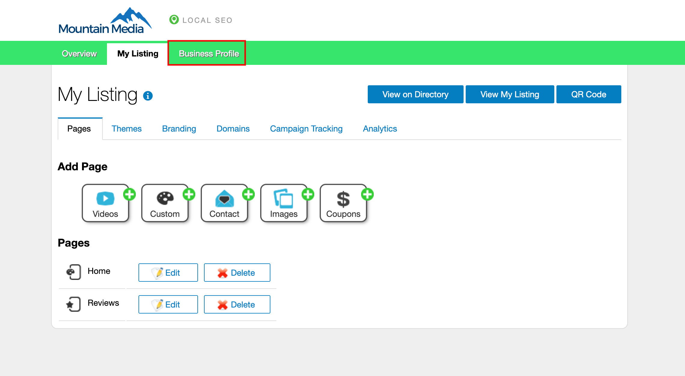
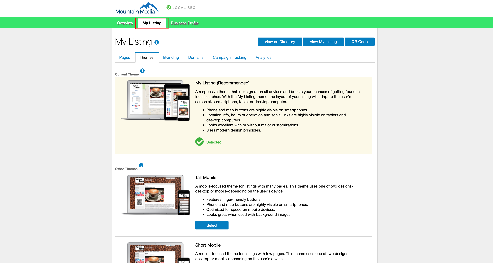
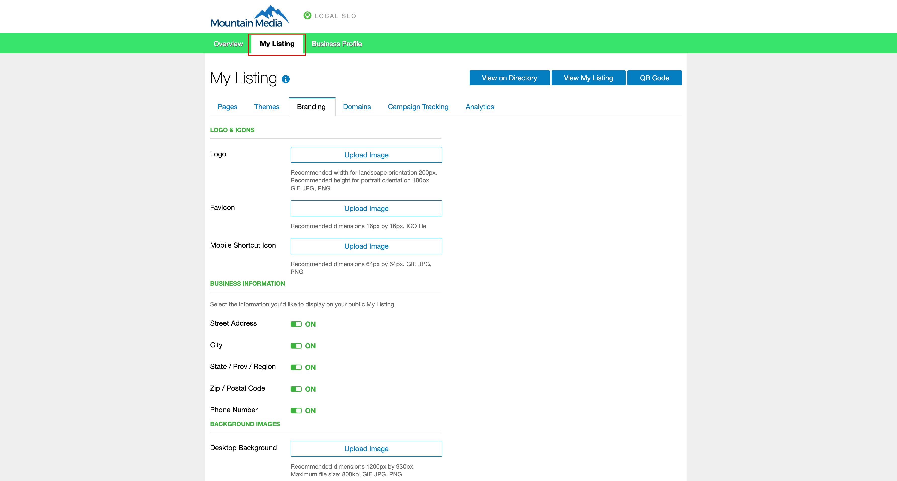
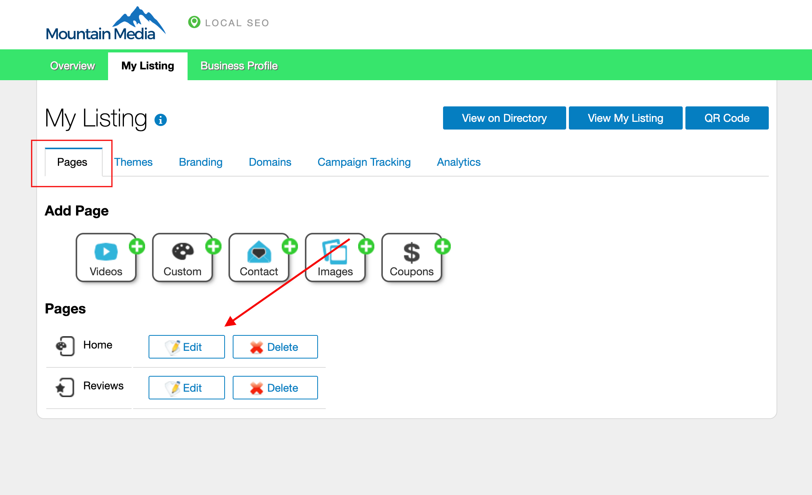
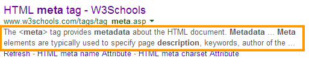
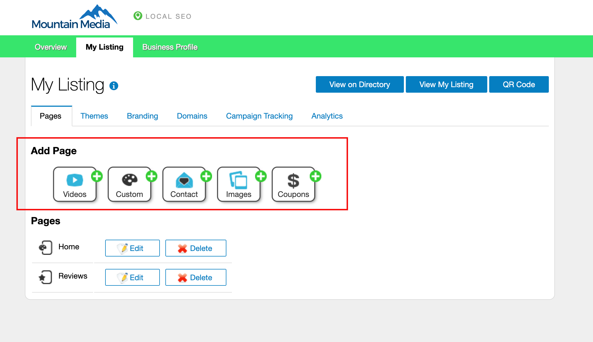

# My Listing

The My Listing feature in Local SEO allows businesses to create a customizable online business profile that showcases their business information, services, and other important details. This section provides information on how to create, customize, and analyze your My Listing page.

## What is My Listing?

My Listing lets you create a customizable online business profile that showcases business information, services, and other details. You can choose a theme, add branding, customize the domain, create pages, and track engagement through event analytics.

## Why is My Listing important?

- Present essential business information in one place
- Use responsive themes that adapt to different screen sizes
- Customize branding and domain to match your needs
- Track how visitors interact with your listing

## What’s included with My Listing?

- **Business Profile**: Complete the profile that powers your listing content
- **Themes**: Choose a responsive layout
- **Branding**: Upload logo, favicon, and mobile shortcut icons
- **Domains**: Use a custom slug, custom domain, or mobile subdomain
- **Pages**: Create and manage pages such as Images, Contact, Coupons, Videos, and Custom
- **Home Page**: Edit title, content, and metadata
- **Event Analytics**: Track visitor actions such as viewing hours, map, contact info, and more

## How to create and customize your listing

### 1) enter business information
Open `Local SEO` > `My Listing` > `Manage My Listing` > `Business Profile` and complete the profile. The information you enter will appear on the listing.

### 2) select a theme
Go to `My Listing` > `Themes` to select the listing style. The `My Listing` Page theme is the default and is responsive. `Responsive` will adapt to different screen sizes, while `Short Mobile` or `Tall Mobile` are designed primarily for smartphones.

### 3) customize the branding
Upload your `logo`, `favicon`, and `iPhone/Android Shortcut Icon`.

If the business is home-based or service-based, you can select the information you want to hide from the listing.

If you upload a `background image`, ensure it meets the specified size. Background images appear only when the device matches the corresponding size. On other screens, the background color displays instead.

### 4) customize the domain

There are three ways to customize the URL of your listing:

1. **Custom Slug**: Keep the listing on your Local SEO domain but customize the end of the URL (the slug).
   - Go to `My Listing` > `Manage My Listing` > `Domains`.
   - In `Edit Slug`, enter the text that should appear after the root domain. Replace spaces with dashes.
   - Cost: Free

2. **Custom Domain**: Use your listing as the main website (for example, `www.mybusiness.com`).
   - You will need to add TXT and A record entries in your DNS settings.

3. **Custom Domain on mobile subdomain**: Use your listing as the mobile site (for example, desktop at `mybusiness.com`, listing at `m.mybusiness.com`).
   - You will need to add TXT and CNAME entries in your DNS settings.

### 5) update the home page
Go to `My Listing` > `Pages` and click `Edit` beside the `Home` page.

Fill in the fields as you want them to display on the site.

- Although `Meta Keywords` are not commonly used by larger search engines, you can enter site keywords separated by commas.
- `Meta Description` is the two lines of text that appear below a site in web search. Limit to 155 characters and write a descriptive, keyword-rich summary. Each page should have a unique description.

### 6) create additional pages
Click a page type to create a new page:

- `Images`: Create gallery-like pages for the website
- `Contact`: Create a page for visitors to contact the business
- `Coupons`: Create a page dedicated to promotion coupons (set start, end, and expiry dates, and select an image for each coupon)
- `Videos`: Create a videos page where you can embed videos from online video hosts
- `Custom`: Create pages that are not covered by the other categories

Enter the order in which the page should appear in the main website menu. Fill in all mandatory fields and as many other options as needed. Click `Create Page` and repeat as required.

## My Listing event analytics

Each time a visitor takes an action on your listing (for example, viewing the map), the event is tracked and added to the Event Analytics chart so you can measure engagement.

Tracked events include:

- View Hours
- View Map
- View Contact Information
- View Video
- Call Business
- Link to Full Website
- View Image
- Scanned QR Code