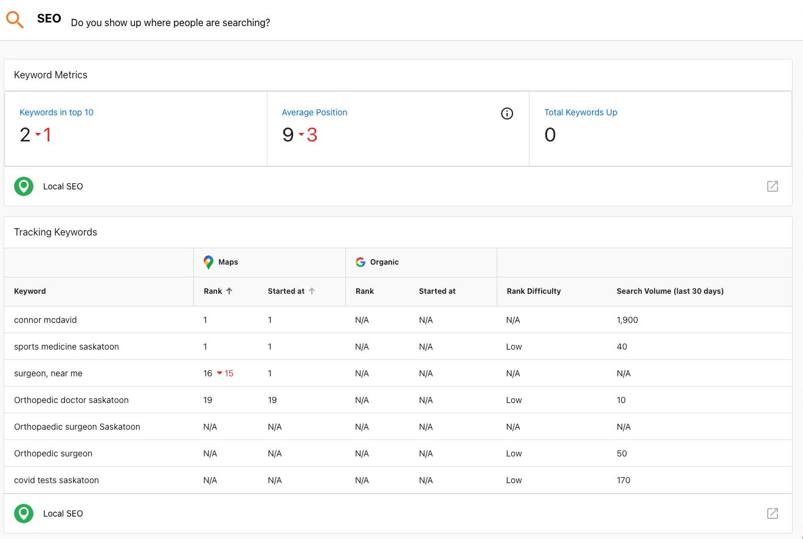
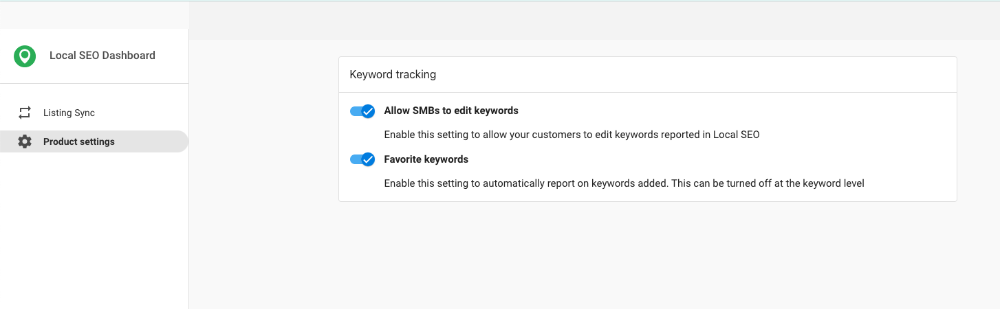
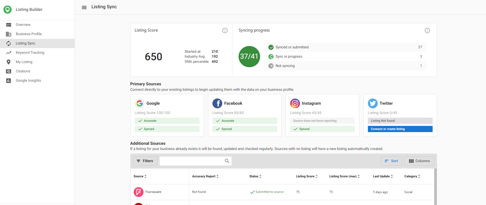
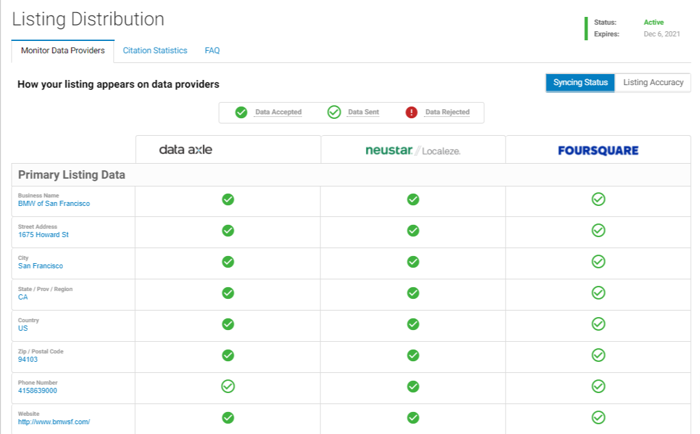

# Local SEO

Local SEO allows your clients and prospects to customize search engine-optimized listings, view the status of their business listings on the four major data providers with Listing Distribution, and instantaneously sync business info to reputable listing sites with Listing Sync.

## What is Local SEO?

Local SEO is a suite of products designed to improve a business's visibility online and within maps/navigation apps, and includes these products:

- **Listing Builder**
- **Online Reviews**
- **Social Marketing**

## What Can the Local SEO Products Do?

### Listings Builder

Listing Builder ensures that a business's contact information is distributed and kept up to date on over 70 online directories. Its key features include:

- A real-time scan of a business's online presence to identify listing inconsistencies
- Directory synchronization of essential business information
- Google Business Profile management
- First-party review generation on the most important platforms

### Online Reviews

Online Reviews gives businesses the ability to generate and respond to customer reviews across multiple platforms from a single dashboard. It includes features such as:

- Review monitoring across multiple platforms in one dashboard
- Review generation through first-party review requests
- Review response capabilities
- Review widgets for website implementation
- Google Seller Ratings that can display business reviews in AdWords

### Social Marketing

Social Marketing helps businesses effectively manage and grow their presence on social media platforms. It offers:

- Social media post creation, scheduling, and publishing across multiple platforms
- Advanced post targeting options
- A content library with thousands of pre-written posts
- Social media platform connection to the Business Center
- Social media post analytics

## Mobile App Support

The Local SEO products are also available in the mobile app, allowing business owners to manage these solutions on-the-go.

## Sections

- [General](general)
- [FAQs](faqs)
- [Business Profile](business-profile)
- [Listing Sync](listing-sync)
- [Keyword Tracking](keyword-tracking)
- [Citation Builder](citation-builder)
- [My Listing](my-listing)
- [Analytics](analytics)
- [Listing Sync Pro](listing-sync-pro)